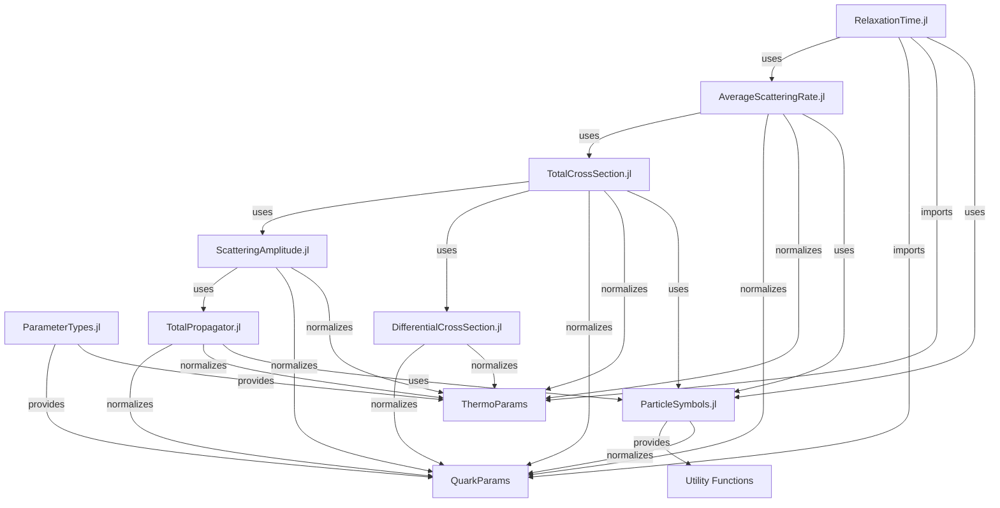

# Design Document: Parameter Struct Migration

## Overview

This design document specifies the implementation approach for migrating the PNJL model Julia codebase to use `QuarkParams` and `ThermoParams` structs as the standard parameter representation, while maintaining full backward compatibility with existing NamedTuple-based code.

The migration follows a **dual interface pattern**: public functions accept both struct and NamedTuple inputs through Julia's multiple dispatch, with internal normalization at function boundaries to ensure consistent behavior. This approach allows gradual migration without breaking existing code, while establishing structs as the recommended pattern for new development.

The design focuses on Phase A of the migration plan: full struct-ification of the RelaxationTime module chain, including:
- RelaxationTime.jl (main entry point)
- AverageScatteringRate.jl (scattering rate calculations)
- TotalCrossSection.jl (cross-section integration)
- ScatteringAmplitude.jl (amplitude calculations)
- DifferentialCrossSection.jl (differential cross-sections)
- TotalPropagator.jl (propagator calculations)
- ParticleSymbols.jl (utility functions)

## Architecture

### Current State

The codebase currently has:
1. **Shared Parameter Types**: `QuarkParams` and `ThermoParams` defined in `src/ParameterTypes.jl` and loaded at Main level
2. **Partial Struct Support**: `TransportCoefficients.jl` already supports structs via `TransportRequest` pattern
3. **Mixed Usage**: Most functions in the RelaxationTime chain only accept NamedTuples
4. **Include-Based Organization**: Modules use `include()` rather than standard Julia package structure

### Target Architecture

The target architecture implements a **dual interface with internal normalization**:

```
┌─────────────────────────────────────────────────────────────┐
│                    Public API Layer                          │
│  Functions accept Union{NamedTuple, QuarkParams/ThermoParams}│
└─────────────────────────────────────────────────────────────┘
                            │
                            ▼
┌─────────────────────────────────────────────────────────────┐
│              Normalization Layer                             │
│  _nt_quark(q) / _nt_thermo(t) convert to NamedTuple         │
└─────────────────────────────────────────────────────────────┘
                            │
                            ▼
┌─────────────────────────────────────────────────────────────┐
│              Internal Implementation                         │
│  All internal logic uses consistent NamedTuple representation│
└─────────────────────────────────────────────────────────────┘
```

**Key Design Decisions**:

1. **Union Types for Public APIs**: Use `Union{NamedTuple, QuarkParams}` and `Union{NamedTuple, ThermoParams}` in function signatures
2. **Normalization at Boundaries**: Convert structs to NamedTuples immediately at function entry using inline helper functions
3. **Internal Consistency**: All internal functions work with NamedTuples to avoid type instability
4. **No Breaking Changes**: Existing NamedTuple-based code continues to work without modification
5. **Struct as Recommended**: Documentation and examples show struct usage as the primary pattern

### Module Dependency Graph



## Components and Interfaces

### 1. Normalization Helpers

Each module that accepts struct parameters will define inline normalization helpers:

```julia
@inline _nt_quark(q) = q isa QuarkParams ? as_namedtuple(q) : q
@inline _nt_thermo(t) = t isa ThermoParams ? as_namedtuple(t) : t
```

**Design Rationale**:
- `@inline` ensures zero runtime overhead for the type check and conversion
- Handles both struct and NamedTuple inputs uniformly
- Centralizes conversion logic for easy maintenance
- Returns NamedTuple representation for internal consistency

### 2. RelaxationTime Module

**Public Functions**:
- `relaxation_times(quark_params, thermo_params, K_coeffs; ...)`
- `compute_average_rates(quark_params, thermo_params, K_coeffs; ...)`
- `relaxation_rates(densities, rates)`

**Interface Changes**:

```julia
# Before (NamedTuple only)
function relaxation_times(
    quark_params::NamedTuple,
    thermo_params::NamedTuple,
    K_coeffs::NamedTuple;
    ...
)

# After (Dual interface)
function relaxation_times(
    quark_params::Union{NamedTuple, QuarkParams},
    thermo_params::Union{NamedTuple, ThermoParams},
    K_coeffs::NamedTuple;
    ...
)
    # Normalize at entry
    quark_params = _nt_quark(quark_params)
    thermo_params = _nt_thermo(thermo_params)
    
    # Rest of implementation unchanged
    ...
end
```

**Key Functions to Update**:
- `relaxation_times`: Main entry point
- `compute_average_rates`: Computes average scattering rates
- `ensure_quark_params_has_A`: Adds A field if missing (already normalizes internally)

### 3. AverageScatteringRate Module

**Public Functions**:
- `average_scattering_rate(process, quark_params, thermo_params, K_coeffs; ...)`
- `build_w0cdf_pchip_cache(process, quark_params, thermo_params, K_coeffs; ...)`
- `precompute_cross_section!(cache, quark_params, thermo_params, K_coeffs; ...)`

**Interface Changes**:

```julia
function average_scattering_rate(
    process::Symbol,
    quark_params::Union{NamedTuple, QuarkParams},
    thermo_params::Union{NamedTuple, ThermoParams},
    K_coeffs::NamedTuple;
    ...
)
    quark_params = _nt_quark(quark_params)
    thermo_params = _nt_thermo(thermo_params)
    
    # Implementation continues with NamedTuples
    ...
end
```

**Helper Functions to Update**:
- `get_mass(flavor, quark_params)`: Extract mass for a flavor
- `get_mu(flavor, quark_params)`: Extract chemical potential for a flavor

These helpers already work with NamedTuples internally, so they just need Union type signatures.

### 4. TotalCrossSection Module

**Public Functions**:
- `total_cross_section(process, s, quark_params, thermo_params, K_coeffs; ...)`
- `calculate_all_total_cross_sections(s, quark_params, thermo_params, K_coeffs; ...)`
- `scan_s_dependence(s_values, process, quark_params, thermo_params, K_coeffs; ...)`

**Interface Changes**:

```julia
function total_cross_section(
    process::Symbol,
    s::Float64,
    quark_params::Union{NamedTuple, QuarkParams},
    thermo_params::Union{NamedTuple, ThermoParams},
    K_coeffs::NamedTuple;
    ...
)
    quark_params = _nt_quark(quark_params)
    thermo_params = _nt_thermo(thermo_params)
    
    # Implementation continues
    ...
end
```

**Key Functions**:
- `total_cross_section`: Main cross-section calculation
- `calculate_all_total_cross_sections`: Batch calculation for all processes
- `scan_s_dependence`: S-dependent cross-section scanning
- `calculate_t_bounds`: Kinematic boundary calculation
- `calculate_final_state_energies`: Energy calculation from Mandelstam variables

### 5. ScatteringAmplitude Module

**Public Functions**:
- `scattering_amplitude_squared(process, s, t, quark_params, thermo_params, K_coeffs; ...)`

**Interface Changes**:

```julia
function scattering_amplitude_squared(
    process::Symbol,
    s::Float64,
    t::Float64,
    quark_params::Union{NamedTuple, QuarkParams},
    thermo_params::Union{NamedTuple, ThermoParams},
    K_coeffs::NamedTuple;
    ...
)
    quark_params = _nt_quark(quark_params)
    thermo_params = _nt_thermo(thermo_params)
    
    # Implementation continues
    ...
end
```

### 6. DifferentialCrossSection Module

**Public Functions**:
- `differential_cross_section(process, s, t, quark_params, thermo_params, K_coeffs; ...)`

**Interface Changes**:

```julia
function differential_cross_section(
    process::Symbol,
    s::Float64,
    t::Float64,
    quark_params::Union{NamedTuple, QuarkParams},
    thermo_params::Union{NamedTuple, ThermoParams},
    K_coeffs::NamedTuple;
    ...
)
    quark_params = _nt_quark(quark_params)
    thermo_params = _nt_thermo(thermo_params)
    
    # Implementation continues
    ...
end
```

### 7. TotalPropagator Module

**Public Functions**:
- `total_propagator_simple(process, channel, meson_list, k0, k_norm, quark_params, thermo_params, K_coeffs)`
- `total_propagator_mixed(process, channel, meson_channel, k0, k_norm, quark_params, thermo_params, K_coeffs)`
- `total_propagator_auto(process, channel, k0, k_norm, quark_params, thermo_params, K_coeffs)`
- `calculate_cms_momentum(process, s, t, channel, quark_params; u=nothing)`
- `calculate_all_propagators(process, k0, k_norm, quark_params, thermo_params, K_coeffs)`

**Interface Changes**:

```julia
function total_propagator_simple(
    process::Symbol,
    channel::Symbol,
    meson_list::Vector{Symbol},
    k0::Float64,
    k_norm::Float64,
    quark_params::Union{NamedTuple, QuarkParams},
    thermo_params::Union{NamedTuple, ThermoParams},
    K_coeffs::NamedTuple
)
    quark_params = _nt_quark(quark_params)
    thermo_params = _nt_thermo(thermo_params)
    
    # Implementation continues
    ...
end
```

### 8. ParticleSymbols Module

**Public Functions**:
- `get_mass(particle, quark_params)`
- `get_chemical_potential(particle, quark_params)`
- `get_quark_masses_for_process(process, quark_params)`

**Interface Changes**:

```julia
function get_mass(
    particle::Symbol,
    quark_params::Union{NamedTuple, QuarkParams}
)::Float64
    quark_params = _nt_quark(quark_params)
    
    # Implementation continues with NamedTuple
    ...
end
```

**Design Note**: ParticleSymbols is a utility module used by many other modules. Adding struct support here ensures all downstream code can work with structs seamlessly.

## Data Models

### QuarkParams Struct

Already defined in `src/ParameterTypes.jl`:

```julia
struct QuarkParams
    m::NamedTuple  # (u=..., d=..., s=...)
    μ::NamedTuple  # (u=..., d=..., s=...)
end
```

**Construction**:
```julia
# From NamedTuple
q = QuarkParams((m=(u=1.52, d=1.52, s=3.04), μ=(u=0.3, d=0.3, s=0.3)))

# From keyword arguments (if constructor added)
q = QuarkParams(m=(u=1.52, d=1.52, s=3.04), μ=(u=0.3, d=0.3, s=0.3))
```

**Conversion**:
```julia
# Struct to NamedTuple
nt = as_namedtuple(q)  # Returns (m=..., μ=...)
```

### ThermoParams Struct

Already defined in `src/ParameterTypes.jl`:

```julia
struct ThermoParams
    T::Float64
    Φ::Float64
    Φbar::Float64
    ξ::Float64
end
```

**Construction**:
```julia
# From NamedTuple
t = ThermoParams((T=0.15, Φ=0.5, Φbar=0.5, ξ=0.0))

# Direct construction
t = ThermoParams(0.15, 0.5, 0.5, 0.0)
```

**Conversion**:
```julia
# Struct to NamedTuple
nt = as_namedtuple(t)  # Returns (T=..., Φ=..., Φbar=..., ξ=...)
```

### Extended QuarkParams with A Field

Some functions require the `A` field (one-loop integral values). The `ensure_quark_params_has_A` function handles this:

```julia
function ensure_quark_params_has_A(quark_params, thermo_params)::NamedTuple
    quark_params = _nt_quark(quark_params)
    thermo_params = _nt_thermo(thermo_params)
    
    if hasproperty(quark_params, :A)
        return quark_params
    end
    
    # Compute A values
    A_u = A(quark_params.m.u, quark_params.μ.u, thermo_params.T, ...)
    A_d = A(quark_params.m.d, quark_params.μ.d, thermo_params.T, ...)
    A_s = A(quark_params.m.s, quark_params.μ.s, thermo_params.T, ...)
    
    return merge(quark_params, (A=(u=A_u, d=A_d, s=A_s),))
end
```

This function already normalizes inputs internally, so it works with both structs and NamedTuples.

## Correctness Properties

*A property is a characteristic or behavior that should hold true across all valid executions of a system—essentially, a formal statement about what the system should do. Properties serve as the bridge between human-readable specifications and machine-verifiable correctness guarantees.*

Before writing correctness properties, I'll analyze each acceptance criterion for testability.


### Property Reflection

After analyzing all acceptance criteria, I identified significant redundancy in the testable properties:

**Redundancies Found:**
1. Properties 1.2, 2.2, 3.2, 4.2, 5.2, 6.2, 7.5, and 11.1-11.7 all test the same core behavior: struct inputs produce identical results to NamedTuple inputs. These can be consolidated into a single comprehensive equivalence property.

2. Properties 1.1, 1.3, 1.4, 2.1, 3.1, 4.1, 5.1, 6.1 test that struct inputs produce "correct" outputs. This is logically subsumed by the equivalence property - if struct results equal NamedTuple results (which are known correct), then struct results are correct.

3. Properties 2.4, 4.4, 7.1, 7.2, 7.3 all test field extraction from structs. These can be combined into a single property about correct field access.

4. Properties 3.4, 3.5, 6.4 test batch operations, which are covered by the main equivalence property applied to those functions.

**Consolidated Approach:**
Instead of 20+ individual properties, we have 4 comprehensive properties that provide complete coverage:
1. Struct-NamedTuple equivalence for all public functions
2. Field extraction correctness for helper functions
3. Conversion round-trip preservation
4. Backward compatibility verification

This consolidation eliminates redundancy while ensuring thorough validation of the migration.

### Correctness Properties

Property 1: Struct-NamedTuple Equivalence for Public Functions

*For any* valid QuarkParams struct `q_struct`, ThermoParams struct `t_struct`, and their NamedTuple equivalents `q_nt = as_namedtuple(q_struct)` and `t_nt = as_namedtuple(t_struct)`, calling any public function with struct parameters should produce numerically identical results (within floating-point tolerance) to calling the same function with NamedTuple parameters.

This property applies to all public functions in the migration scope:
- `relaxation_times(q, t, K; ...)` 
- `compute_average_rates(q, t, K; ...)`
- `average_scattering_rate(process, q, t, K; ...)`
- `total_cross_section(process, s, q, t, K; ...)`
- `scattering_amplitude_squared(process, s, t_var, q, t, K; ...)`
- `differential_cross_section(process, s, t_var, q, t, K; ...)`
- `total_propagator_simple(process, channel, mesons, k0, k, q, t, K)`
- `total_propagator_mixed(process, channel, meson_channel, k0, k, q, t, K)`
- `calculate_cms_momentum(process, s, t_var, channel, q; ...)`
- `calculate_all_propagators(process, k0, k, q, t, K)`

**Validates: Requirements 1.2, 2.2, 3.2, 4.2, 5.2, 6.2, 7.5, 11.1, 11.2, 11.3, 11.4, 11.5, 11.6, 11.7**

---

Property 2: Field Extraction Correctness

*For any* valid QuarkParams struct `q` and particle symbol `p` (one of :u, :d, :s, :ubar, :dbar, :sbar), the helper functions `get_mass(p, q)` and `get_chemical_potential(p, q)` should extract the same values whether `q` is a struct or a NamedTuple.

Specifically:
- `get_mass(:u, q_struct) == get_mass(:u, as_namedtuple(q_struct))`
- `get_chemical_potential(:u, q_struct) == get_chemical_potential(:u, as_namedtuple(q_struct))`
- And similarly for all other particle symbols

Additionally, for any scattering process symbol `proc`, `get_quark_masses_for_process(proc, q_struct)` should return the same tuple of four masses as `get_quark_masses_for_process(proc, as_namedtuple(q_struct))`.

**Validates: Requirements 2.4, 4.4, 7.1, 7.2, 7.3**

---

Property 3: Conversion Round-Trip Preservation

*For any* valid QuarkParams struct `q` and ThermoParams struct `t`, converting to NamedTuple and back should preserve all field values:

```julia
q_nt = as_namedtuple(q)
q_reconstructed = QuarkParams(q_nt)
# q_reconstructed should have identical field values to q

t_nt = as_namedtuple(t)
t_reconstructed = ThermoParams(t_nt)
# t_reconstructed should have identical field values to t
```

This ensures that the conversion functions are true inverses of each other, enabling seamless interoperability between struct and NamedTuple representations.

**Validates: Requirements 9.5**

---

Property 4: Backward Compatibility Preservation

*For all* existing test cases that use NamedTuple parameters, running the tests after the migration should produce identical results to running them before the migration.

This is verified by:
1. Running the existing test suite before any migration changes
2. Recording all test results and outputs
3. Running the same test suite after migration (without modifying the tests)
4. Verifying that all tests that passed before still pass, and all numerical results are identical within tolerance

**Validates: Requirements 8.1, 8.2**

---

Property 5: Extended QuarkParams with A Field

*For any* valid QuarkParams struct `q` (with or without an `A` field) and ThermoParams struct `t`, calling `ensure_quark_params_has_A(q, t)` should return a NamedTuple that:
1. Contains all fields from `q` (m, μ)
2. Contains an `A` field with structure `(u=..., d=..., s=...)`
3. If `q` already had an `A` field, the returned value should preserve it
4. If `q` lacked an `A` field, the returned value should have a newly computed `A` field

The function should work identically whether `q` is a struct or NamedTuple.

**Validates: Requirements 9.4**

## Error Handling

### Input Validation

**Struct Construction Errors**:

```julia
# Missing required fields
try
    q = QuarkParams((m=(u=1.52, d=1.52, s=3.04)))  # Missing μ
catch e
    # Should raise: "QuarkParams: input is missing field :μ"
end

try
    t = ThermoParams((T=0.15, Φ=0.5))  # Missing Φbar
catch e
    # Should raise: "ThermoParams: input is missing field :Φbar"
end
```

The existing constructors in `ParameterTypes.jl` already implement this validation. No changes needed.

**Type Errors**:

```julia
# Invalid type passed to function expecting Union{NamedTuple, QuarkParams}
function relaxation_times(
    quark_params::Union{NamedTuple, QuarkParams},
    ...
)
    quark_params = _nt_quark(quark_params)  # Handles both types
    ...
end

# If user passes wrong type (e.g., Dict), Julia's type system will catch it
relaxation_times(Dict(:m => ...), ...)  # MethodError: no method matching
```

Julia's type system provides automatic validation for Union types. No additional error handling needed.

### Normalization Edge Cases

**Handling Nothing/Missing Values**:

The normalization helpers handle the common case where inputs might be either struct or NamedTuple:

```julia
@inline _nt_quark(q) = q isa QuarkParams ? as_namedtuple(q) : q
@inline _nt_thermo(t) = t isa ThermoParams ? as_namedtuple(t) : t
```

If `q` or `t` is `nothing` or some other invalid type, the function will pass it through unchanged, and the downstream code will raise an appropriate error when trying to access fields.

**Field Access Errors**:

```julia
# If NamedTuple is missing required fields
quark_params = (m=(u=1.52, d=1.52, s=3.04),)  # Missing μ
try
    relaxation_times(quark_params, ...)
catch e
    # Will raise when trying to access quark_params.μ
    # Error message: "type NamedTuple has no field μ"
end
```

The existing code already handles these errors appropriately. No changes needed.

### Numerical Stability

**Floating-Point Comparison Tolerance**:

When testing struct vs NamedTuple equivalence, we need appropriate tolerances for floating-point comparison:

```julia
# For most physics calculations
const RTOL = 1e-12  # Relative tolerance
const ATOL = 1e-14  # Absolute tolerance

function test_equivalence(result_struct, result_nt)
    @test isapprox(result_struct, result_nt, rtol=RTOL, atol=ATOL)
end
```

**Edge Cases**:
- Very small values near zero: use absolute tolerance
- Very large values: use relative tolerance
- Inf/NaN: should be identical (not approximately equal)

## Testing Strategy

### Dual Testing Approach

The migration requires both **unit tests** and **property-based tests** to ensure correctness:

**Unit Tests**:
- Verify specific examples with known correct outputs
- Test edge cases (zero masses, zero temperature, etc.)
- Test error conditions (missing fields, invalid inputs)
- Verify backward compatibility with existing test cases
- Test integration between modules

**Property-Based Tests**:
- Verify struct-NamedTuple equivalence across random inputs
- Test field extraction correctness with random parameters
- Verify conversion round-trip preservation
- Test numerical stability across parameter ranges

Both approaches are complementary and necessary for comprehensive coverage.

### Property-Based Testing Configuration

**Library Selection**: Use **[Supposition.jl](https://github.com/Seelengrab/Supposition.jl)** for property-based testing in Julia. Supposition provides:
- Hypothesis-style property testing for Julia
- Integrated shrinking for minimal failing examples
- Composable data generators
- Good integration with Julia's Test framework

**Test Configuration**:
- Minimum 100 iterations per property test (to account for randomization)
- Each property test must reference its design document property
- Tag format: `# Feature: parameter-struct-migration, Property N: <property_text>`

**Example Property Test Structure**:

```julia
using Test
using Supposition

# Feature: parameter-struct-migration, Property 1: Struct-NamedTuple Equivalence
@testset "relaxation_times struct equivalence" begin
    @check max_examples=100 function property_relaxation_times_equivalence(
        m_u = Data.Floats(0.1, 5.0),
        m_d = Data.Floats(0.1, 5.0),
        m_s = Data.Floats(0.1, 10.0),
        μ_u = Data.Floats(0.0, 1.0),
        μ_d = Data.Floats(0.0, 1.0),
        μ_s = Data.Floats(0.0, 1.0),
        T = Data.Floats(0.05, 0.3),
        Φ = Data.Floats(0.0, 1.0),
        Φbar = Data.Floats(0.0, 1.0),
    )
        # Create struct parameters
        q_struct = QuarkParams(
            m=(u=m_u, d=m_d, s=m_s),
            μ=(u=μ_u, d=μ_d, s=μ_s)
        )
        t_struct = ThermoParams(T, Φ, Φbar, 0.0)
        
        # Create NamedTuple parameters
        q_nt = as_namedtuple(q_struct)
        t_nt = as_namedtuple(t_struct)
        
        # Compute with both representations
        result_struct = relaxation_times(q_struct, t_struct, K_coeffs; densities=test_densities, ...)
        result_nt = relaxation_times(q_nt, t_nt, K_coeffs; densities=test_densities, ...)
        
        # Verify equivalence
        @test isapprox(result_struct.tau.u, result_nt.tau.u, rtol=1e-12)
        @test isapprox(result_struct.tau.s, result_nt.tau.s, rtol=1e-12)
        # ... test all fields
    end
end
```

### Unit Test Coverage

**Test Files to Create/Update**:

1. `tests/unit/relaxtime/test_relaxation_time_struct.jl`
   - Test `relaxation_times` with struct inputs
   - Test `compute_average_rates` with struct inputs
   - Test struct-NamedTuple equivalence
   - Test error handling for invalid structs

2. `tests/unit/relaxtime/test_average_scattering_rate_struct.jl`
   - Test `average_scattering_rate` with struct inputs
   - Test `build_w0cdf_pchip_cache` with struct inputs
   - Test helper functions (`get_mass`, `get_mu`) with structs
   - Test struct-NamedTuple equivalence

3. `tests/unit/relaxtime/test_total_cross_section_struct.jl`
   - Test `total_cross_section` with struct inputs
   - Test `calculate_all_total_cross_sections` with struct inputs
   - Test `scan_s_dependence` with struct inputs
   - Test struct-NamedTuple equivalence

4. `tests/unit/relaxtime/test_scattering_amplitude_struct.jl`
   - Test `scattering_amplitude_squared` with struct inputs
   - Test struct-NamedTuple equivalence

5. `tests/unit/relaxtime/test_differential_cross_section_struct.jl`
   - Test `differential_cross_section` with struct inputs
   - Test struct-NamedTuple equivalence

6. `tests/unit/relaxtime/test_total_propagator_struct.jl`
   - Test propagator functions with struct inputs
   - Test `calculate_cms_momentum` with struct inputs
   - Test struct-NamedTuple equivalence

7. `tests/unit/utils/test_particle_symbols_struct.jl`
   - Test `get_mass` with struct inputs
   - Test `get_chemical_potential` with struct inputs
   - Test `get_quark_masses_for_process` with struct inputs
   - Test struct-NamedTuple equivalence

8. `tests/unit/test_parameter_types.jl`
   - Test struct construction and validation
   - Test `as_namedtuple` conversion
   - Test round-trip conversion (struct → NamedTuple → struct)
   - Test error handling for missing fields

**Backward Compatibility Tests**:

Run all existing tests without modification to verify backward compatibility:
- `tests/unit/relaxtime/test_transport_coefficients.jl`
- `tests/unit/relaxtime/test_transport_workflow.jl`
- `tests/unit/relaxtime/test_meson_mass_mott_transition.jl`
- All other existing test files

These tests should pass without any changes, demonstrating that the migration preserves existing functionality.

### Integration Tests

**Cross-Module Integration**:

Test that struct parameters flow correctly through the entire call chain:

```julia
@testset "Full chain integration with structs" begin
    # Create struct parameters
    q = QuarkParams(m=(u=1.52, d=1.52, s=3.04), μ=(u=0.3, d=0.3, s=0.3))
    t = ThermoParams(0.15, 0.5, 0.5, 0.0)
    K = (K_pi=..., K_K=..., ...)
    
    # Call top-level function
    result = relaxation_times(q, t, K; densities=test_densities, ...)
    
    # Verify result structure
    @test haskey(result, :tau)
    @test haskey(result, :tau_inv)
    @test haskey(result, :rates)
    
    # Verify all values are finite and positive
    @test all(isfinite, values(result.tau))
    @test all(>(0), values(result.tau))
end
```

### Performance Tests

While not part of correctness properties, performance tests verify that the migration doesn't introduce significant overhead:

```julia
using BenchmarkTools

@testset "Performance comparison" begin
    q_struct = QuarkParams(...)
    t_struct = ThermoParams(...)
    q_nt = as_namedtuple(q_struct)
    t_nt = as_namedtuple(t_struct)
    
    # Benchmark struct version
    time_struct = @belapsed relaxation_times($q_struct, $t_struct, $K; densities=$densities)
    
    # Benchmark NamedTuple version
    time_nt = @belapsed relaxation_times($q_nt, $t_nt, $K; densities=$densities)
    
    # Verify performance is within 5% (allowing for measurement noise)
    @test time_struct / time_nt < 1.05
end
```

## Implementation Notes

### Module Loading Order

The current include-based organization requires careful attention to loading order:

1. **ParameterTypes must be loaded first** at Main level:
   ```julia
   if !isdefined(Main, :ParameterTypes)
       Base.include(Main, joinpath(@__DIR__, "..", "ParameterTypes.jl"))
   end
   ```

2. **Each module imports from Main.ParameterTypes**:
   ```julia
   using Main.ParameterTypes: QuarkParams, ThermoParams, as_namedtuple
   ```

3. **Never include ParameterTypes.jl multiple times** - this would create multiple type instances and cause "same name, different type" errors.

### Inline Optimization

The normalization helpers must be inlined to avoid performance overhead:

```julia
@inline _nt_quark(q) = q isa QuarkParams ? as_namedtuple(q) : q
@inline _nt_thermo(t) = t isa ThermoParams ? as_namedtuple(t) : t
```

Julia's `@inline` macro ensures these functions are compiled away, leaving just the type check and field access.

### Type Stability

The dual interface maintains type stability because:

1. **Normalization happens at function entry**: All downstream code sees consistent NamedTuple types
2. **Union types are resolved early**: The type check `q isa QuarkParams` is resolved at compile time for each call site
3. **No dynamic dispatch on parameter types**: Once normalized, all code paths use the same types

### Documentation Updates

Each modified function needs updated docstrings:

```julia
"""
    relaxation_times(quark_params, thermo_params, K_coeffs; kwargs...)

Calculate quark relaxation times based on average scattering rates.

# Arguments
- `quark_params`: Quark parameters, either a `QuarkParams` struct or a NamedTuple with fields `m` and `μ`
- `thermo_params`: Thermodynamic parameters, either a `ThermoParams` struct or a NamedTuple with fields `T`, `Φ`, `Φbar`, `ξ`
- `K_coeffs`: Coupling coefficients as a NamedTuple

# Returns
A NamedTuple with fields:
- `tau`: Relaxation times for each quark flavor
- `tau_inv`: Inverse relaxation times (scattering rates)
- `rates`: Average scattering rates for all processes

# Examples
```julia
# Using structs (recommended)
q = QuarkParams(m=(u=1.52, d=1.52, s=3.04), μ=(u=0.3, d=0.3, s=0.3))
t = ThermoParams(0.15, 0.5, 0.5, 0.0)
result = relaxation_times(q, t, K_coeffs; densities=densities)

# Using NamedTuples (backward compatible)
q_nt = (m=(u=1.52, d=1.52, s=3.04), μ=(u=0.3, d=0.3, s=0.3))
t_nt = (T=0.15, Φ=0.5, Φbar=0.5, ξ=0.0)
result = relaxation_times(q_nt, t_nt, K_coeffs; densities=densities)
```
"""
```

## Migration Checklist

### Phase A: RelaxationTime Chain Struct-ification

- [ ] Update `RelaxationTime.jl`
  - [ ] Add Union types to `relaxation_times` signature
  - [ ] Add Union types to `compute_average_rates` signature
  - [ ] Verify `ensure_quark_params_has_A` works with structs (already does)
  - [ ] Update docstrings

- [ ] Update `AverageScatteringRate.jl`
  - [ ] Add normalization helpers `_nt_quark`, `_nt_thermo`
  - [ ] Add Union types to `average_scattering_rate` signature
  - [ ] Add Union types to `build_w0cdf_pchip_cache` signature
  - [ ] Add Union types to `precompute_cross_section!` signature
  - [ ] Update `get_mass` and `get_mu` signatures
  - [ ] Update docstrings

- [ ] Update `TotalCrossSection.jl`
  - [ ] Add normalization helpers
  - [ ] Add Union types to `total_cross_section` signature
  - [ ] Add Union types to `calculate_all_total_cross_sections` signature
  - [ ] Add Union types to `scan_s_dependence` signature
  - [ ] Update docstrings

- [ ] Update `ScatteringAmplitude.jl`
  - [ ] Add normalization helpers
  - [ ] Add Union types to `scattering_amplitude_squared` signature
  - [ ] Update docstrings

- [ ] Update `DifferentialCrossSection.jl`
  - [ ] Add normalization helpers
  - [ ] Add Union types to `differential_cross_section` signature
  - [ ] Update docstrings

- [ ] Update `TotalPropagator.jl`
  - [ ] Add normalization helpers
  - [ ] Add Union types to all propagator function signatures
  - [ ] Add Union types to `calculate_cms_momentum` signature
  - [ ] Update docstrings

- [ ] Update `ParticleSymbols.jl`
  - [ ] Add normalization helper `_nt_quark`
  - [ ] Add Union types to `get_mass` signature
  - [ ] Add Union types to `get_chemical_potential` signature
  - [ ] Add Union types to `get_quark_masses_for_process` signature
  - [ ] Update docstrings

- [ ] Create comprehensive test suite
  - [ ] Unit tests for each module
  - [ ] Property-based tests for equivalence
  - [ ] Integration tests for full chain
  - [ ] Backward compatibility verification
  - [ ] Performance benchmarks

- [ ] Update documentation
  - [ ] Module-level documentation explaining dual interface
  - [ ] Migration guide for users
  - [ ] Examples showing struct usage
  - [ ] API reference updates
