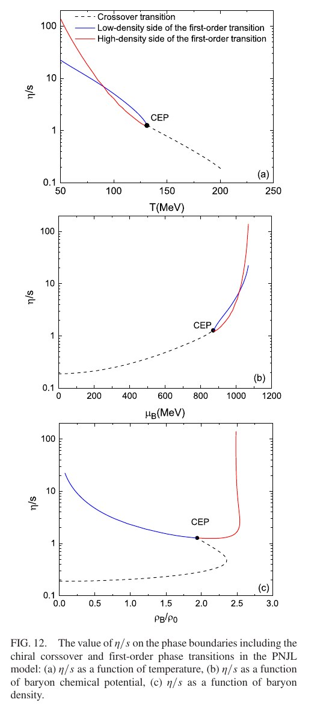
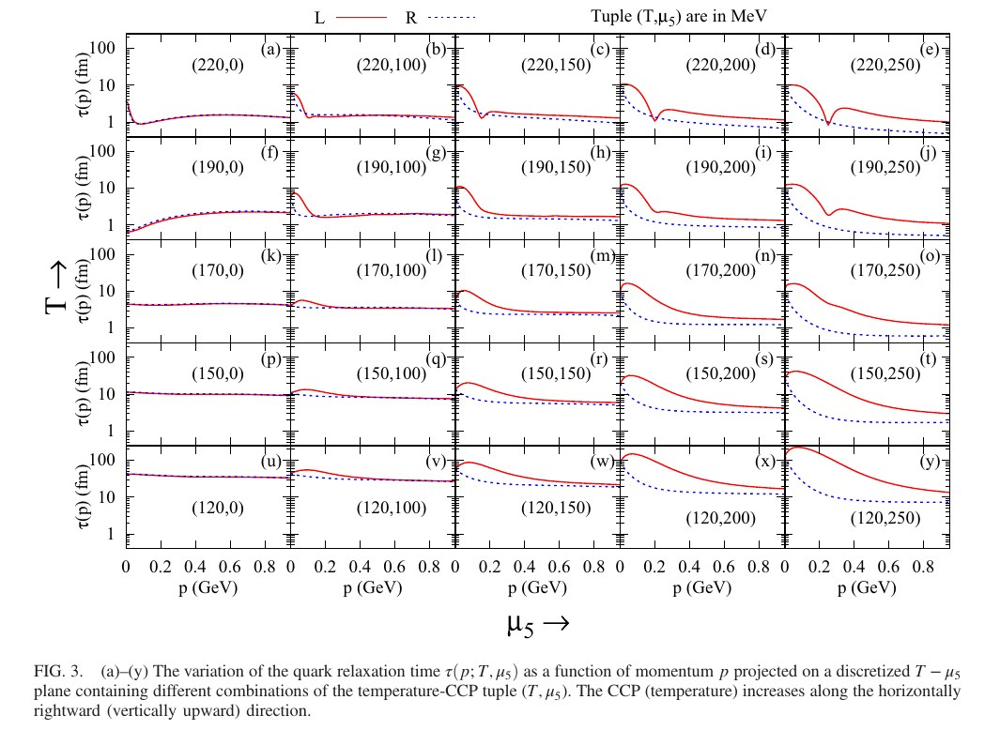
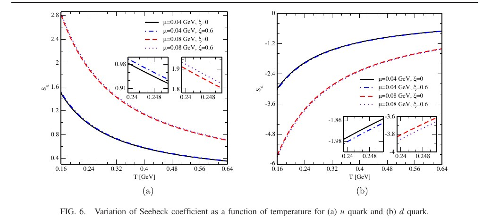

# PNJL / 各向异性 QCD 输运论文绘图习惯调查

审阅日期：2026-10-05。状态：定向文献视觉审计已完成；对下一版设计和 SOP 的建议尚未实施。

**这批相关论文中，整幅图外置于顶部的共享图例确实少见：148 幅合格定量图中有 2 幅（1.35%），来自 16 篇中的 1 篇。125 幅（84.46%）仅使用图内图例。** 两幅顶部图例均服务于 25 面板阵列，且只有简短一行。没有观察到 v12 那样的两行整图顶部图例。

这支持“下一版先试紧凑图内图例”的设计方向，但不能推导出“顶部图例不符合 PRD 要求”或“所有密集图都应把图例塞回图内”。本调查是固定的定向样本，包含相近作者群，且没有恰好 9 或 12 面板的图；不能把样本比例当作整个领域的使用率或布局优劣实验。

## 统计口径与结果

样本为 8 篇 PNJL/NJL 核心输运论文及 8 篇相邻的动量各向异性 QCD 输运论文，实际发表年份为 2019–2026 年，期刊为 12 篇 PRD、4 篇 PRC。逐一检查全部 151 幅编号图；排除 C05 的 Fig. 1（三维曲面）以及 Figs. 6–7（费曼图），保留 148 幅二维定量线图/点图。

统计单位是**整幅编号图**。多面板图只计一幅；inset 不作为额外编号图或主面板。只要存在顶部外置系列 key，就归为“顶部外置”；存在其他外置 key 而无顶部 key，则归为“其他外置”。这些类别在图层面互斥。

| 图例 / 系列解释方式 | 核心组，102 幅 | 相邻组，46 幅 | 合计，148 幅 | 合计占比 |
|---|---:|---:|---:|---:|
| 仅图内图例 | 83 | 42 | 125 | 84.46% |
| 顶部外置图例 | 2 | 0 | 2 | 1.35% |
| 其他外置图例 | 3 | 4 | 7 | 4.73% |
| 曲线直接标注或图注映射，无系列 key | 8 | 0 | 8 | 5.41% |
| 单一系列，无需 key | 6 | 0 | 6 | 4.05% |
| 尚未判定 | 0 | 0 | 0 | 0 |

“图内上方”属于第一行。坐标区域上方只写固定温度、化学势、面板标题或单位，**不**计作顶部图例。C08 Figs. 2–3 就有这种顶部条件文字；颜色/线型的映射在图注中，故归入“直接标注或图注”。C01 Fig. 7 的说明从左面板跨过分隔线延伸至中间面板，但仍处于无间距的连续绘图区中，归入图内，并在逐图记录中特别注明其跨面板情况。

论文层面，15/16 篇至少有一幅图内图例，1/16 篇至少有一幅顶部外置图例，2/16 篇使用其他外置图例。论文层面这些事件可重叠，不能相加作为分母。

### 更换分母后的检查

| 子样本 | 论文数 | 合格图数 | 顶部外置图数 | 比例 |
|---|---:|---:|---:|---:|
| 全部 | 16 | 148 | 2 | 1.35% |
| 仅正式出版 PDF | 13 | 117 | 2 | 1.71% |
| 仅 PRD 论文，允许作者版 | 12 | 112 | 2 | 1.79% |
| 仅多面板图 | 14 | 68 | 2 | 2.94% |
| 仅直接输运相关图 | 16 | 79 | 1 | 1.27% |
| 仅有显式系列 key 的图 | 16 | 134 | 2 | 1.49% |

直接输运子集包括弛豫时间、粘滞/电/热/热电输运、重夸克拖曳/扩散、输运量的导数或无量纲组合。排除仅为输入的质量、热力学量、截面/平均跃迁率，以及末态能损和 R_AA。各图是否进入该子集已逐项保存在 `figure_audit.csv`，不用于改变主统计分母。

主面板数分布为：1 面板 80 幅、2 面板 38 幅、3 面板 14 幅、4 面板 8 幅、6 面板 4 幅、8 面板 2 幅、25 面板 2 幅。C03 Fig. 4 的 (a)–(d) 每组有左右两个坐标区域，按 8 个主面板记录。**本样本没有 9/12 面板图**，因此 v12 的版式选择仍须实际试排，不能只照搬单图统计。

## 具体图例与绘图方法

### 可以直接用于设计参照的例子

| 证据 | 观察 | 对我们有用的部分 |
|---|---|---|
| C03，PRD 113, 014036 (2026)，Fig. 12，PDF 第 11 页 | 三个竖排面板，只在首个面板的空白区放一次相变 key；明确区分 crossover 与一阶转变两侧 | 一次图内共享图例可以承担多面板解释；相变语义写清楚，不必每个条目重复同一长前缀 |
| C04，PRD 111, 076012 (2025)，Figs. 2–3，PDF 第 10–11 页 | 两幅 5×5 阵列均在顶部放简短一行共享 key；Fig. 3 只有 L/R 两种线 | 顶部图例是有领域实例的选项；需控制说明长度与高度，其密度和 v12 两行长说明不同 |
| A04，PRC 105, 054903 (2022)，Figs. 1–4，PDF 第 5–6 页 | 参数 key 放在每个坐标轴右侧，全部属于“其他外置” | 外置不等于顶部；但轴旁说明会占横向空间，需要按最终版心判断 |
| A01，PRD 113, 076004 (2026)，Figs. 6–7，PDF 第 11 页 | 图内 key 配合局部 inset，展示全范围下几乎重合的曲线 | 保留整体趋势，同时用有明确范围的细节图说明小差异；支持 v12 局部视图的方向 |
| C01，PRC 113, 045213 (2026)，Figs. 2、6；C03 Figs. 11、13、15 | 温度或轨迹参数直接写在曲线端部/附近 | 分离良好的少量曲线可直接标注；交叉或拥挤的曲线不应机械改用直接标注 |

首面板共享图例的干净参照：



真实的顶部共享图例反例：



局部细节的参照：



这些图片为指定 PDF 页面的局部裁图，用于比较布局；不是最终印刷尺寸模拟，也没有据此反推源字号。精确 PDF hash、页码、裁图坐标和输出 hash 在 `examples_manifest.json` 中。

### 其他值得吸收的习惯

- **条件、变量、线型各自承担明确的解释任务。** 很多图把固定 T 或 μ 放在面板上方，把变化参数放进 key，单位直接跟随坐标量。顶部条件文字无需再作为系列条目重复。
- **矩阵布局围绕物理比较组织。** C04 用行/列表示温度和手征化学势变化；A02 用列表示不同化学势，行表示不同物理量。我们的 μ_B 列、物理量行因此有相近的领域参照，值得保留。
- **常见的是完整边框、刻度和白色背景。** 图内 key 常放在曲线未占用的一角；有些有边框，有些无边框。没有依据把“必须有/无图例框”再升级成通用硬规则。本调查没有测量每幅图的精确主/小刻度长度和朝向。
- **颜色与线型需要按实际追踪效果评估。** 部分论文同时用两者，另一些主要依赖颜色。我们应保留既有彩色与灰度验证，不能由“文献也是这样画”推断灰度一定可辨。
- **线性和对数轴围绕数据动态范围选择。** C03 Fig. 4 在不同物理情形使用不同轴尺度，并明确标示。v12 的 log-y 不能仅为追随视觉风格而取消；科学比较需要一致尺度时应在相应行/列统一。
- **inset/局部图是已有的表达手段。** 明确检出的例子包括 C01 Fig. 2、A01 Figs. 6–7、A05 Fig. 2。采用哪个窗口仍应由论述目标决定，不通过重新平滑来制造可读性。

已经发表的图也不应逐项照搬。例如 C01 Fig. 7 的长图例跨过了内部面板分隔线；A01 Fig. 6 使用方括号单位，而本次读取的 APS 页面建议单位用圆括号。这些是样本观察，不是需要复制的验收标准。

## 对 v12 和下一版 SOP 的建议

### 下一版图形的优先候选

建议从 v11 的分置思路出发，保留 v12 对最终尺寸、数学字形、灰度和局部细节的检查：

1. **先试图内共享。** 参数 key 候选放在 (a) 的实际空白区，端点 key 候选放在 (c) 的实际空白区。具体位置仍须以新一轮曲线/端点遮挡检查为准。
2. **精简重复文字。** 参数 key 以 α_T 为共同标题，条目只列数值；端点 key 以 `First-order` 为共同标题，下列 `restored` / `broken`。保留圆形/方形映射及既有物理含义，不把一阶转变名称删掉，也不从别篇论文直接替换成未经核实的密度分支术语。
3. **保留备用布局。** 如果在目标尺寸下图内文字仍与关键曲线冲突，再比较简短一行顶部 key、轴旁 key 或专门的说明面板。不能把样本中的低频现象变成禁用规则。
4. **维持数据与最终尺寸门禁。** 不重算，不改冻结顶点、断线或相变端点；不以缩小到不可读字号来满足图内摆放。主图的低值细节仍由明确标注窗口的局部图补充。

这些是下一版的试排顺序，**没有证明 (a)/(c) 在全部字高限制下已经放得下**。本次没有生成 v13、修改 v12 文件或改变作者视觉接受状态。

### SOP 文字应如何调整

隔离工作区当前 `docs/guides/sop/workflows/figure_production.md` 第 242–247、259–260 行，把“图外公共图例”设为默认，将图内放置描述成例外。调查支持把图内/图外改为按图族选择的正常候选，让验证约束承担质量控制。

建议替换为如下规则，待下一版实现时同步检查案例合同、样式配置、validator 和相关测试：

> 图例位置由目标图族、相关文献版式和实际曲线占用共同决定。PNJL / 各向异性输运图优先试排图内共享或分置图例；无法满足最终尺寸、关键曲线可见性和文字可读性时，比较轴旁、顶部或独立说明面板。任何位置均须在 manifest 中声明并通过裁切、文字重叠及曲线/端点遮挡检查。图例与坐标区域几何相交本身不代表遮挡失败；实际遮挡关键内容仍应失败。已登记的图内位置不应仅因处于 axes 内就被判为不合格。

> 共同条件、系列参数与相变语义分别表达。优先移除重复文字，而非压低字号。只有在映射完整、跨面板一致且不影响阅读时才共用一份 key；正文/图注应说明各行、各列和标记含义。

> 自动检查通过后，仍在拟定插入尺寸下检查彩色与灰度的曲线追踪、端点辨认和重要低值差异。文献版式相似度、零遮挡和作者视觉接受是不同检查项，不能相互替代。

图例位置的这些候选与现有最终字高、线宽、标记、PDF 质量以及冻结数值约束可以同时保留；本次证据不支持放宽数值或绘图验收容差。

## 与 APS 官方要求的关系

本次实际读取了 [APS Style Basics](https://journals.aps.org/authors/style-basics)，缓存与来源信息为 `aps_style_basics.txt`、`aps_style_source.json`；HTML 原文 hash 及本地位置在 `source_cache_manifest.json`。

其原文允许：

> Define figure symbols and curves either in a legend in the figure itself or in the caption.

该段没有要求图例必须处于顶部，也没有将顶部外置布局列为禁用。页面另外要求按期刊页面的实际尺寸保证细节可读，最小大写字母和数字高度至少 2 mm，数据点直径至少 1 mm，曲线线宽至少 0.18 mm（0.5 point），并建议采用可访问调色板。是否使用灰度印刷也需要相应设计。

因此应分开判断：**官方技术要求**决定最低交付约束，**文献调查**提供目标读者熟悉的版式参照，**当前数据的可读性**决定候选中哪一种实际可用。本次没有逐篇测量源 PDF 的字形毫米数，也不评价样本文献的投稿合规资格。

## 文献清单和逐篇计数

下表中“内 / 顶 / 其他外 / 直接或图注 / 无需”为五类互斥图数。完整题名、作者、arXiv、全文来源、版本、页码映射和 SHA-256 见 `papers.json`。每幅图的面板数、位置、共享方式、输运子集、轴尺度、边框、编码与备注见 `figure_audit.csv`。

| ID | 期刊及年份 | DOI | 合格图数 | 内 / 顶 / 其他外 / 直接或图注 / 无需 |
|---|---|---|---:|---|
| C01 | PRC 113, 045213 (2026) | [10.1103/yp8h-pdkr](https://doi.org/10.1103/yp8h-pdkr) | 7 | 5 / 0 / 0 / 2 / 0 |
| C02 | PRD 113, 034016 (2026) | [10.1103/wdfm-gsgg](https://doi.org/10.1103/wdfm-gsgg) | 19 | 13 / 0 / 0 / 0 / 6 |
| C03 | PRD 113, 014036 (2026) | [10.1103/fp2p-rkpp](https://doi.org/10.1103/fp2p-rkpp) | 18 | 15 / 0 / 0 / 3 / 0 |
| C04 | PRD 111, 076012 (2025) | [10.1103/PhysRevD.111.076012](https://doi.org/10.1103/PhysRevD.111.076012) | 7 | 5 / 2 / 0 / 0 / 0 |
| C05 | PRC 103, 054901 (2021) | [10.1103/PhysRevC.103.054901](https://doi.org/10.1103/PhysRevC.103.054901) | 18 | 15 / 0 / 3 / 0 / 0 |
| C06 | PRC 103, 034904 (2021) | [10.1103/PhysRevC.103.034904](https://doi.org/10.1103/PhysRevC.103.034904) | 7 | 7 / 0 / 0 / 0 / 0 |
| C07 | PRD 101, 096006 (2020) | [10.1103/PhysRevD.101.096006](https://doi.org/10.1103/PhysRevD.101.096006) | 20 | 20 / 0 / 0 / 0 / 0 |
| C08 | PRD 99, 014004 (2019) | [10.1103/PhysRevD.99.014004](https://doi.org/10.1103/PhysRevD.99.014004) | 6 | 3 / 0 / 0 / 3 / 0 |
| A01 | PRD 113, 076004 (2026) | [10.1103/rjkc-9gdc](https://doi.org/10.1103/rjkc-9gdc) | 10 | 10 / 0 / 0 / 0 / 0 |
| A02 | PRD 113, 054005 (2026) | [10.1103/phyn-xc87](https://doi.org/10.1103/phyn-xc87) | 11 | 11 / 0 / 0 / 0 / 0 |
| A03 | PRD 108, 096016 (2023) | [10.1103/PhysRevD.108.096016](https://doi.org/10.1103/PhysRevD.108.096016) | 4 | 4 / 0 / 0 / 0 / 0 |
| A04 | PRC 105, 054903 (2022) | [10.1103/PhysRevC.105.054903](https://doi.org/10.1103/PhysRevC.105.054903) | 4 | 0 / 0 / 4 / 0 / 0 |
| A05 | PRD 104, 094037 (2021) | [10.1103/PhysRevD.104.094037](https://doi.org/10.1103/PhysRevD.104.094037) | 2 | 2 / 0 / 0 / 0 / 0 |
| A06 | PRD 103, 094009 (2021) | [10.1103/PhysRevD.103.094009](https://doi.org/10.1103/PhysRevD.103.094009) | 4 | 4 / 0 / 0 / 0 / 0 |
| A07 | PRD 103, 074017 (2021) | [10.1103/PhysRevD.103.074017](https://doi.org/10.1103/PhysRevD.103.074017) | 4 | 4 / 0 / 0 / 0 / 0 |
| A08 | PRD 102, 036011 (2020) | [10.1103/PhysRevD.102.036011](https://doi.org/10.1103/PhysRevD.102.036011) | 7 | 7 / 0 / 0 / 0 / 0 |

13 篇采用可公开获取的正式出版 PDF；C05、C06、C08 的出版 PDF 公开端点返回 401，采用合法开放的 arXiv 作者版。其 PDF 内版本戳分别确认为 2011.03505v2、1901.09543v3、1809.07594v1。作者版的布局不代表已经核验对应期刊终版；已单列 117 幅出版版敏感性统计。

## 检索、偏倚和验证边界

检索沿用中断任务的 INSPIRE 公开 API 记录。完整 PNJL 查询返回 39 条，NJL 查询返回 165 条，带年份及 PRD/PRC 限制的各向异性查询返回 148 条；去重并集 317 条。另有一次 880 条命中的宽泛各向异性试查，只取回前 250 条，**未将这个不完整试查当作抽样框**。Crossref 用于交叉核对这 16 篇的出版元数据，不是独立的主题检索数据库。

原抽样计划见保留原文的 `protocol_original.md`，完整查询见 `search_log.json`。必须承认一个恢复局限：虽然保留了 317 条候选和固定的 16 篇名单，**另外 301 条逐条未纳入理由没有在原产物中留下可复核记录**。`screening_frame.csv` 对此明确写 `individual reason not retained`，没有事后编造排除原因。因此不宣称严格实现“最近八篇”的完整可复核排名，也不把本调查称为系统综述或领域普查。

其他边界：

- 图嵌套于论文中；C01/C03 有共同作者，A03–A07 也存在明显共同作者群。16 篇不是 16 个完全独立的风格来源，不计算总体置信区间。
- 核心组和相邻组物理主题不同；两组单列。磁场相关相邻论文只有同时讨论动量分布各向异性时才进入既定样本；没有据此推广到全部磁化介质或全部 QCD 作图。
- 最终逐图判读由一个审阅代理完成，没有第二位独立编码者。大多数指标是可直接观察的布局属性，仍允许作者按保留的 PDF 页和记录逐项纠正。
- C06/C08 的旧作者 PDF 在 Poppler 渲染中出现 Symbol/ArialUnicode 字体替代警告。图框、系列样本和所在区域可辨；位置判断结合原图注，未据此判断希腊字形质量或尺寸。
- 缩略页用于全量覆盖，顶部 key、条件标题、跨面板 key 和复杂面板数另用较大裁图确认。修复了旧提取器只接受 `FIG. 1.`、遗漏 `FIG. 1:` 的问题，补齐 C06/C08 的 13 幅图。

已完成的验证：16 个源 PDF SHA-256 全部匹配；16 篇 Crossref 记录均有成功核对结果；151 个编号图全部有编码或明确排除，图号连续且与各文末最大图号引用一致；所有统计由逐图表重算。现有 v12 两张主图、总 manifest 和 SOP 的保护 hash 在 `existing_v12_protection.json` 中。本调查没有运行求解器、改数值、修改现有 SOP 或晋升投稿资格。

### 文件与复算入口

- `figure_audit.csv`：151 行，含 3 行明确排除；同时给出 DOI、版本、PDF 页码与 hash。
- `paper_summary.csv`、`summary.json`：逐篇统计和敏感性分母。
- `visual_coding.json`：人工判断源；`papers.json`：精简文献和图号/页码映射。
- `screening_frame.csv`、`search_log.json`、`protocol_original.md`：检索与抽样记录及缺失边界。
- `examples/`、`examples_manifest.json`：5 份带来源的布局裁图。
- `source_cache_manifest.json`：原始查询、PDF 获取记录、完整审阅页清单及 APS 原文缓存的路径和 hash。
- `verification.json`、`artifact_manifest.json`：本包最终核验结果及文件 hash。

在本隔离工作区根目录可运行：

```powershell
python scripts/analysis/relaxtime/summarize_figure_style_audit.py docs/analysis/relaxtime/phase_guided_transport/literature_figure_style_audit_20261005 --verify-pdfs
```

复算使用标准库和保存的人工判断，不联网；`--verify-pdfs` 另外核对原缓存中的 PDF 实体。源缓存位于 `D:/Temp/pnjl_figure_style_audit_20261005`，未随报告复制全部大体积检索响应和论文 PDF。迁移机器时须保留该缓存，或按来源 URL 重新获取并逐个匹配 hash；仅重算计数则可不加 `--verify-pdfs`。
