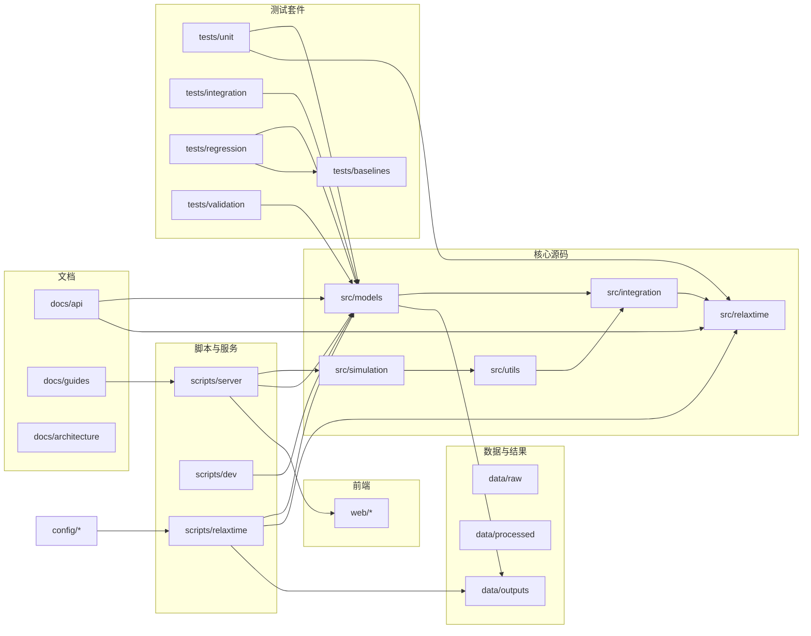
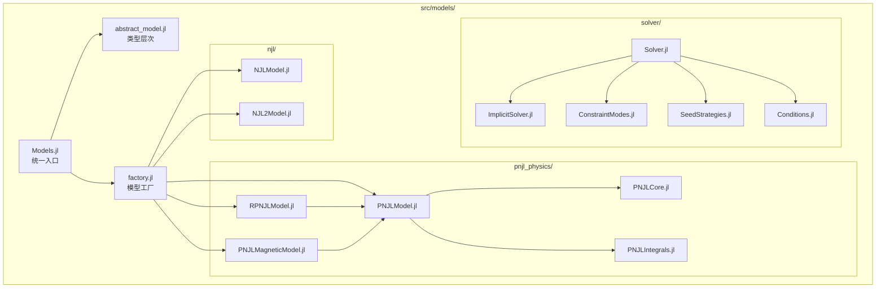
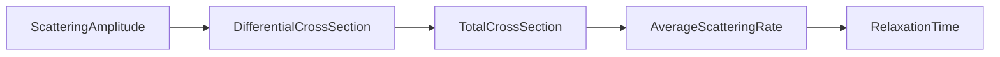
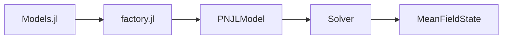
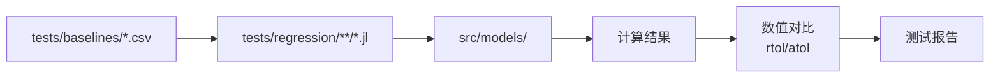

## L1 高层架构图（手动）

```mermaid
flowchart LR
  subgraph Data[数据与结果]
    data_raw[data/raw]
    data_processed[data/processed]
    data_outputs[data/outputs]
  end

  subgraph Docs[文档]
    docs_api[docs/api]
    docs_guides[docs/guides]
    docs_arch[docs/architecture]
  end

  subgraph Source[核心源码]
    src_models[src/models]
    src_utils[src/utils]
    src_integration[src/integration]
    src_simulation[src/simulation]
    src_relaxtime[src/relaxtime]
  end

  subgraph Scripts[脚本与服务]
    scripts_server[scripts/server]
    scripts_dev[scripts/dev]
    scripts_relaxtime[scripts/relaxtime]
  end

  subgraph Tests[测试套件]
    tests_unit[tests/unit]
    tests_integration[tests/integration]
    tests_regression[tests/regression]
    tests_validation[tests/validation]
    tests_baselines[tests/baselines]
  end

  subgraph Web[前端]
    web_static[web/*]
  end

  config[config/*]

  src_utils --> src_integration
  src_models --> src_integration
  src_integration --> src_relaxtime
  src_simulation --> src_utils

  scripts_server --> src_simulation
  scripts_server --> src_models
  scripts_server --> web_static
  scripts_relaxtime --> src_models
  scripts_relaxtime --> src_relaxtime
  scripts_dev --> src_models

  docs_api --> src_models
  docs_api --> src_relaxtime
  docs_guides --> scripts_server

  src_models --> data_outputs
  scripts_relaxtime --> data_outputs

  tests_unit --> src_models
  tests_unit --> src_relaxtime
  tests_integration --> src_models
  tests_regression --> src_models
  tests_regression --> tests_baselines
  tests_validation --> src_models

  config --> scripts_relaxtime
```

## L2 Models 模块架构（基于多重派发）

```mermaid
flowchart TB
  subgraph Models[src/models/]
    Models.jl[Models.jl<br/>统一入口]
    abstract[abstract_model.jl<br/>类型层次]
    factory[factory.jl<br/>模型工厂]

    subgraph NJL[njl/]
      NJLModel[NJLModel.jl]
      NJL2Model[NJL2Model.jl]
    end

    subgraph PNJL[pnjl_physics/]
      PNJLModel[PNJLModel.jl]
      RPNJLModel[RPNJLModel.jl]
      PNJLMagnetic[PNJLMagneticModel.jl]
      PNJLCore[PNJLCore.jl]
      PNJLIntegrals[PNJLIntegrals.jl]
    end

    subgraph Solver[solver/]
      SolverMain[Solver.jl]
      ImplicitSolver[ImplicitSolver.jl]
      ConstraintModes[ConstraintModes.jl]
      SeedStrategies[SeedStrategies.jl]
      Conditions[Conditions.jl]
    end
  end

  Models.jl --> abstract
  Models.jl --> factory
  factory --> NJLModel
  factory --> NJL2Model
  factory --> PNJLModel
  factory --> RPNJLModel
  factory --> PNJLMagnetic

  PNJLModel --> PNJLCore
  PNJLModel --> PNJLIntegrals
  RPNJLModel --> PNJLModel
  PNJLMagnetic --> PNJLModel

  SolverMain --> ImplicitSolver
  SolverMain --> ConstraintModes
  SolverMain --> SeedStrategies
  SolverMain --> Conditions
```

## L3 关键链路补充（手动）

**弛豫时间链路（RTA）**

```mermaid
flowchart LR
  ScatteringAmplitude[ScatteringAmplitude]
    --> DifferentialCrossSection[DifferentialCrossSection]
    --> TotalCrossSection[TotalCrossSection]
    --> AverageScatteringRate[AverageScatteringRate]
    --> RelaxationTime[RelaxationTime]
```

**PNJL 求解链路（新架构）**

```mermaid
flowchart LR
  Models[Models.jl]
    --> Factory[factory.jl]
    --> PNJLModel[PNJLModel]
    --> Solver[Solver]
    --> Result[MeanFieldState]
```

**回归测试链路**

```mermaid
flowchart LR
  Baselines[tests/baselines/*.csv]
    --> RegressionTests[tests/regression/**/*.jl]
    --> Models[src/models/]
    --> Results[计算结果]
    --> Comparison[数值对比<br/>rtol/atol]
    --> Report[测试报告]
```
