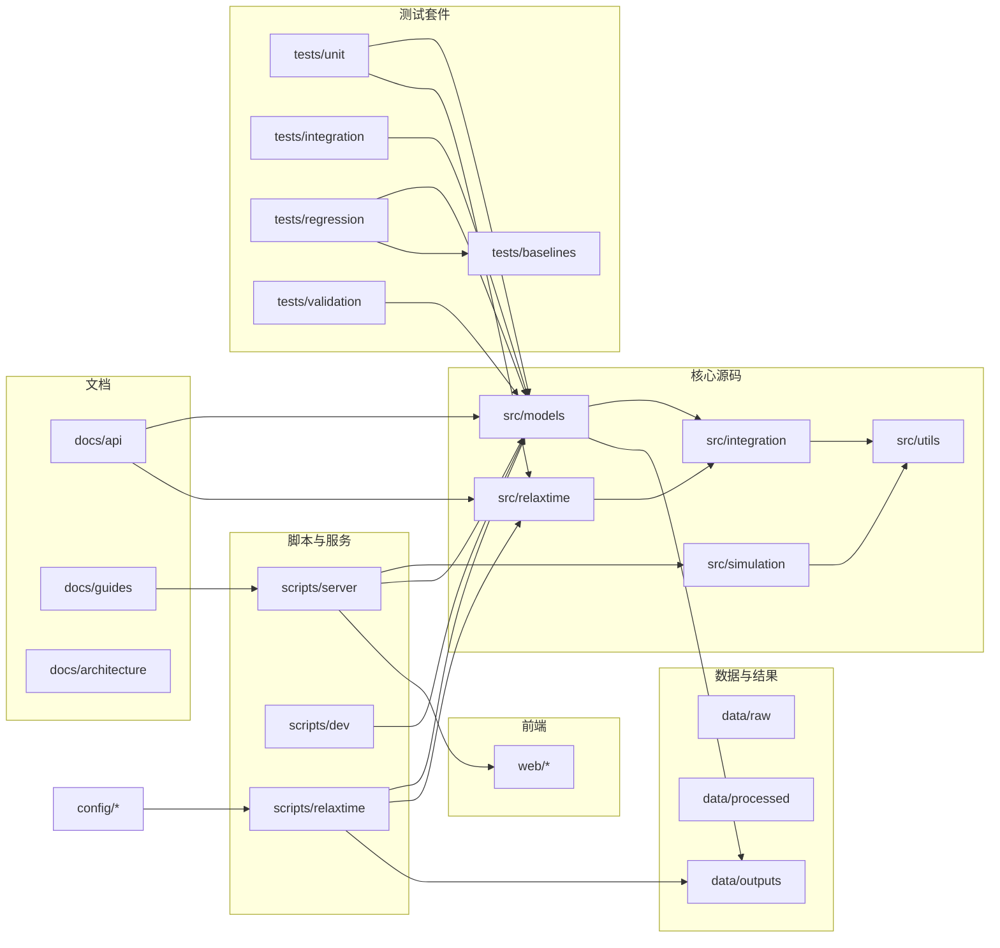
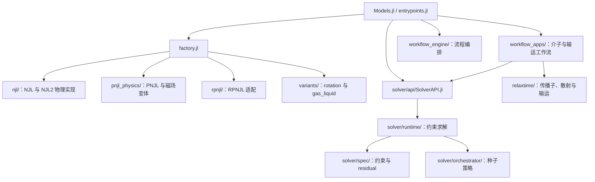
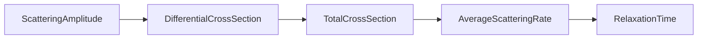

## L1 高层架构图（手动）

## L2 Models 职责与调用

本图按当前职责组织；每条实际文件加载边见自动依赖图。模型的 API/capabilities/adapter 锚点继续保留，目录完整性不再依靠 noop 文件。

`solver/compat/` 和 `solver/diff/` 保存适配与导数诊断接口；热力学导数的当前实现与适用后端见 [derivatives API](../api/models/derived/derivatives/README.md)。

## L3 关键计算步骤

下列箭头表示计算结果的流向，不是文件 include 方向。

统一求解由 `Models` 创建或接收模型，通过 `solver/api/` 进入对应约束求解器；工作流再消费平衡态和热力学量。非 FixedMu 联合求解与 mixed-meson 约定由各自 solver/workflow 合同维护，目录清理不改变这些语义。

回归测试在 `tests/regression/` 将当前计算与 `tests/baselines/` 中的内部基线比较，按各测试既定的 `rtol/atol` 判断；外部文献/实现对照属于 `tests/validation/`。
