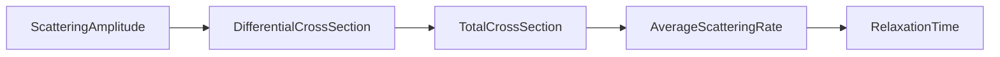

```mermaid
%%{init: { 'flowchart': { 'nodeSpacing': 40, 'rankSpacing': 60, 'useMaxWidth': false } }}%%
flowchart LR
  subgraph Constants_PNJL.jl
    src_Constants_PNJL_jl[Constants_PNJL.jl]
  end
  subgraph QuarkDistribution.jl
    src_QuarkDistribution_jl[QuarkDistribution.jl]
  end
  subgraph QuarkDistribution_Aniso.jl
    src_QuarkDistribution_Aniso_jl[QuarkDistribution_Aniso.jl]
  end
  subgraph integration
    src_integration_GaussLegendre_jl[integration/GaussLegendre.jl]
    src_integration_IntervalQuadratureStrategies_jl[integration/IntervalQuadratureStrategies.jl]
  end
  subgraph pnjl
    src_pnjl_PNJL_jl[pnjl/PNJL.jl]
    src_pnjl_core_Core_jl[pnjl/core/Core.jl]
    src_pnjl_core_Integrals_jl[pnjl/core/Integrals.jl]
    src_pnjl_core_Thermodynamics_jl[pnjl/core/Thermodynamics.jl]
    src_pnjl_derivatives_ThermoDerivatives_jl[pnjl/derivatives/ThermoDerivatives.jl]
    src_pnjl_scans_DualBranchScan_jl[pnjl/scans/DualBranchScan.jl]
    src_pnjl_scans_TmuScan_jl[pnjl/scans/TmuScan.jl]
    src_pnjl_scans_TrhoScan_jl[pnjl/scans/TrhoScan.jl]
    src_pnjl_solver_Conditions_jl[pnjl/solver/Conditions.jl]
    src_pnjl_solver_ConstraintModes_jl[pnjl/solver/ConstraintModes.jl]
    src_pnjl_solver_ImplicitSolver_jl[pnjl/solver/ImplicitSolver.jl]
    src_pnjl_solver_SeedStrategies_jl[pnjl/solver/SeedStrategies.jl]
    src_pnjl_solver_Solver_jl[pnjl/solver/Solver.jl]
    src_pnjl_workflows_TransportWorkflow_jl[pnjl/workflows/TransportWorkflow.jl]
  end
  subgraph relaxtime
    src_relaxtime_AverageScatteringRate_jl[relaxtime/AverageScatteringRate.jl]
    src_relaxtime_EffectiveCouplings_jl[relaxtime/EffectiveCouplings.jl]
    src_relaxtime_MesonPropagator_jl[relaxtime/MesonPropagator.jl]
    src_relaxtime_OneLoopIntegrals_jl[relaxtime/OneLoopIntegrals.jl]
    src_relaxtime_OneLoopIntegralsAniso_jl[relaxtime/OneLoopIntegralsAniso.jl]
    src_relaxtime_PolarizationAniso_jl[relaxtime/PolarizationAniso.jl]
    src_relaxtime_PolarizationCache_jl[relaxtime/PolarizationCache.jl]
    src_relaxtime_RelaxationTime_jl[relaxtime/RelaxationTime.jl]
    src_relaxtime_ScatteringAmplitude_jl[relaxtime/ScatteringAmplitude.jl]
    src_relaxtime_TotalCrossSection_jl[relaxtime/TotalCrossSection.jl]
    src_relaxtime_TotalPropagator_jl[relaxtime/TotalPropagator.jl]
    src_relaxtime_TransportCoefficients_jl[relaxtime/TransportCoefficients.jl]
  end
  subgraph root
    AverageScatteringRate[AverageScatteringRate]
    Conditions[Conditions]
    Constants_PNJL[Constants_PNJL]
    ConstraintModes[ConstraintModes]
    DifferentialCrossSection[DifferentialCrossSection]
    DualBranchScan[DualBranchScan]
    EffectiveCouplings[EffectiveCouplings]
    EllipsoidCalculation[EllipsoidCalculation]
    FrameTransformations[FrameTransformations]
    GaussLegendre[GaussLegendre]
    ImplicitSolver[ImplicitSolver]
    Integrals[Integrals]
    MesonPropagator[MesonPropagator]
    MomentumMapping[MomentumMapping]
    OneLoopIntegrals[OneLoopIntegrals]
    OneLoopIntegralsCorrection[OneLoopIntegralsCorrection]
    PNJL[PNJL]
    PNJLQuarkDistributions[PNJLQuarkDistributions]
    PNJLQuarkDistributions_Aniso[PNJLQuarkDistributions_Aniso]
    ParticleSymbols[ParticleSymbols]
    PhaseTransition[PhaseTransition]
    PolarizationAniso[PolarizationAniso]
    PolarizationCache[PolarizationCache]
    RelaxationTime[RelaxationTime]
    ScatteringAmplitude[ScatteringAmplitude]
    SeedStrategies[SeedStrategies]
    Solver[Solver]
    ThermoDerivatives[ThermoDerivatives]
    Thermodynamics[Thermodynamics]
    TmuScan[TmuScan]
    TotalCrossSection[TotalCrossSection]
    TotalPropagator[TotalPropagator]
    TransportCoefficients[TransportCoefficients]
    TrhoScan[TrhoScan]
  end
  subgraph simulation
    src_simulation_HTTPServer_jl[simulation/HTTPServer.jl]
    src_simulation_MomentumMapping_jl[simulation/MomentumMapping.jl]
  end
  subgraph utils
    src_utils_ParticleSymbols_jl[utils/ParticleSymbols.jl]
  end
  src_QuarkDistribution_Aniso_jl --> PNJLQuarkDistributions
  src_QuarkDistribution_Aniso_jl --> src_QuarkDistribution_jl
  src_integration_IntervalQuadratureStrategies_jl --> src_integration_GaussLegendre_jl
  src_pnjl_PNJL_jl --> Conditions
  src_pnjl_PNJL_jl --> Constants_PNJL
  src_pnjl_PNJL_jl --> ConstraintModes
  src_pnjl_PNJL_jl --> DualBranchScan
  src_pnjl_PNJL_jl --> ImplicitSolver
  src_pnjl_PNJL_jl --> Integrals
  src_pnjl_PNJL_jl --> PhaseTransition
  src_pnjl_PNJL_jl --> SeedStrategies
  src_pnjl_PNJL_jl --> ThermoDerivatives
  src_pnjl_PNJL_jl --> Thermodynamics
  src_pnjl_PNJL_jl --> TmuScan
  src_pnjl_PNJL_jl --> TrhoScan
  src_pnjl_core_Core_jl --> Integrals
  src_pnjl_core_Core_jl --> Thermodynamics
  src_pnjl_core_Core_jl --> src_pnjl_core_Integrals_jl
  src_pnjl_core_Core_jl --> src_pnjl_core_Thermodynamics_jl
  src_pnjl_core_Thermodynamics_jl --> Integrals
  src_pnjl_core_Thermodynamics_jl --> PNJLQuarkDistributions_Aniso
  src_pnjl_core_Thermodynamics_jl --> src_pnjl_core_Integrals_jl
  src_pnjl_derivatives_ThermoDerivatives_jl --> Solver
  src_pnjl_scans_DualBranchScan_jl --> Constants_PNJL
  src_pnjl_scans_DualBranchScan_jl --> ConstraintModes
  src_pnjl_scans_DualBranchScan_jl --> ImplicitSolver
  src_pnjl_scans_DualBranchScan_jl --> SeedStrategies
  src_pnjl_scans_TmuScan_jl --> Constants_PNJL
  src_pnjl_scans_TmuScan_jl --> ConstraintModes
  src_pnjl_scans_TmuScan_jl --> ImplicitSolver
  src_pnjl_scans_TmuScan_jl --> SeedStrategies
  src_pnjl_scans_TrhoScan_jl --> Constants_PNJL
  src_pnjl_scans_TrhoScan_jl --> ConstraintModes
  src_pnjl_scans_TrhoScan_jl --> ImplicitSolver
  src_pnjl_scans_TrhoScan_jl --> SeedStrategies
  src_pnjl_solver_Conditions_jl --> ConstraintModes
  src_pnjl_solver_Conditions_jl --> Thermodynamics
  src_pnjl_solver_ImplicitSolver_jl --> Conditions
  src_pnjl_solver_ImplicitSolver_jl --> ConstraintModes
  src_pnjl_solver_ImplicitSolver_jl --> SeedStrategies
  src_pnjl_solver_ImplicitSolver_jl --> Thermodynamics
  src_pnjl_solver_SeedStrategies_jl --> ConstraintModes
  src_pnjl_solver_Solver_jl --> Conditions
  src_pnjl_solver_Solver_jl --> ConstraintModes
  src_pnjl_solver_Solver_jl --> ImplicitSolver
  src_pnjl_solver_Solver_jl --> SeedStrategies
  src_pnjl_solver_Solver_jl --> src_pnjl_solver_Conditions_jl
  src_pnjl_solver_Solver_jl --> src_pnjl_solver_ConstraintModes_jl
  src_pnjl_solver_Solver_jl --> src_pnjl_solver_ImplicitSolver_jl
  src_pnjl_solver_Solver_jl --> src_pnjl_solver_SeedStrategies_jl
  src_pnjl_workflows_TransportWorkflow_jl --> OneLoopIntegrals
  src_pnjl_workflows_TransportWorkflow_jl --> PNJL
  src_pnjl_workflows_TransportWorkflow_jl --> RelaxationTime
  src_pnjl_workflows_TransportWorkflow_jl --> TransportCoefficients
  src_pnjl_workflows_TransportWorkflow_jl --> src_Constants_PNJL_jl
  src_pnjl_workflows_TransportWorkflow_jl --> src_pnjl_PNJL_jl
  src_pnjl_workflows_TransportWorkflow_jl --> src_relaxtime_OneLoopIntegrals_jl
  src_pnjl_workflows_TransportWorkflow_jl --> src_relaxtime_RelaxationTime_jl
  src_pnjl_workflows_TransportWorkflow_jl --> src_relaxtime_TransportCoefficients_jl
  src_relaxtime_AverageScatteringRate_jl --> Constants_PNJL
  src_relaxtime_AverageScatteringRate_jl --> GaussLegendre
  src_relaxtime_AverageScatteringRate_jl --> PNJLQuarkDistributions
  src_relaxtime_AverageScatteringRate_jl --> PNJLQuarkDistributions_Aniso
  src_relaxtime_AverageScatteringRate_jl --> TotalCrossSection
  src_relaxtime_AverageScatteringRate_jl --> src_Constants_PNJL_jl
  src_relaxtime_AverageScatteringRate_jl --> src_QuarkDistribution_jl
  src_relaxtime_AverageScatteringRate_jl --> src_QuarkDistribution_Aniso_jl
  src_relaxtime_AverageScatteringRate_jl --> src_integration_GaussLegendre_jl
  src_relaxtime_AverageScatteringRate_jl --> src_relaxtime_TotalCrossSection_jl
  src_relaxtime_EffectiveCouplings_jl --> Constants_PNJL
  src_relaxtime_EffectiveCouplings_jl --> OneLoopIntegrals
  src_relaxtime_EffectiveCouplings_jl --> OneLoopIntegralsCorrection
  src_relaxtime_EffectiveCouplings_jl --> src_Constants_PNJL_jl
  src_relaxtime_EffectiveCouplings_jl --> src_relaxtime_OneLoopIntegrals_jl
  src_relaxtime_EffectiveCouplings_jl --> src_relaxtime_OneLoopIntegralsAniso_jl
  src_relaxtime_MesonPropagator_jl --> Constants_PNJL
  src_relaxtime_MesonPropagator_jl --> EffectiveCouplings
  src_relaxtime_MesonPropagator_jl --> src_Constants_PNJL_jl
  src_relaxtime_MesonPropagator_jl --> src_relaxtime_EffectiveCouplings_jl
  src_relaxtime_OneLoopIntegrals_jl --> Constants_PNJL
  src_relaxtime_OneLoopIntegrals_jl --> GaussLegendre
  src_relaxtime_OneLoopIntegrals_jl --> PNJLQuarkDistributions
  src_relaxtime_OneLoopIntegrals_jl --> src_Constants_PNJL_jl
  src_relaxtime_OneLoopIntegrals_jl --> src_QuarkDistribution_jl
  src_relaxtime_OneLoopIntegrals_jl --> src_integration_GaussLegendre_jl
  src_relaxtime_OneLoopIntegrals_jl --> src_integration_IntervalQuadratureStrategies_jl
  src_relaxtime_OneLoopIntegralsAniso_jl --> GaussLegendre
  src_relaxtime_OneLoopIntegralsAniso_jl --> OneLoopIntegrals
  src_relaxtime_OneLoopIntegralsAniso_jl --> PNJLQuarkDistributions_Aniso
  src_relaxtime_OneLoopIntegralsAniso_jl --> src_QuarkDistribution_Aniso_jl
  src_relaxtime_OneLoopIntegralsAniso_jl --> src_integration_GaussLegendre_jl
  src_relaxtime_OneLoopIntegralsAniso_jl --> src_integration_IntervalQuadratureStrategies_jl
  src_relaxtime_OneLoopIntegralsAniso_jl --> src_relaxtime_OneLoopIntegrals_jl
  src_relaxtime_PolarizationAniso_jl --> Constants_PNJL
  src_relaxtime_PolarizationAniso_jl --> OneLoopIntegrals
  src_relaxtime_PolarizationAniso_jl --> OneLoopIntegralsCorrection
  src_relaxtime_PolarizationAniso_jl --> src_Constants_PNJL_jl
  src_relaxtime_PolarizationAniso_jl --> src_relaxtime_OneLoopIntegrals_jl
  src_relaxtime_PolarizationAniso_jl --> src_relaxtime_OneLoopIntegralsAniso_jl
  src_relaxtime_PolarizationCache_jl --> PolarizationAniso
  src_relaxtime_PolarizationCache_jl --> src_relaxtime_PolarizationAniso_jl
  src_relaxtime_RelaxationTime_jl --> AverageScatteringRate
  src_relaxtime_RelaxationTime_jl --> Constants_PNJL
  src_relaxtime_RelaxationTime_jl --> OneLoopIntegrals
  src_relaxtime_RelaxationTime_jl --> TotalCrossSection
  src_relaxtime_RelaxationTime_jl --> src_Constants_PNJL_jl
  src_relaxtime_RelaxationTime_jl --> src_relaxtime_AverageScatteringRate_jl
  src_relaxtime_RelaxationTime_jl --> src_relaxtime_OneLoopIntegrals_jl
  src_relaxtime_RelaxationTime_jl --> src_relaxtime_TotalCrossSection_jl
  src_relaxtime_ScatteringAmplitude_jl --> Constants_PNJL
  src_relaxtime_ScatteringAmplitude_jl --> EffectiveCouplings
  src_relaxtime_ScatteringAmplitude_jl --> OneLoopIntegrals
  src_relaxtime_ScatteringAmplitude_jl --> ParticleSymbols
  src_relaxtime_ScatteringAmplitude_jl --> TotalPropagator
  src_relaxtime_ScatteringAmplitude_jl --> src_Constants_PNJL_jl
  src_relaxtime_ScatteringAmplitude_jl --> src_relaxtime_TotalPropagator_jl
  src_relaxtime_ScatteringAmplitude_jl --> src_utils_ParticleSymbols_jl
  src_relaxtime_TotalCrossSection_jl --> Constants_PNJL
  src_relaxtime_TotalCrossSection_jl --> DifferentialCrossSection
  src_relaxtime_TotalCrossSection_jl --> GaussLegendre
  src_relaxtime_TotalCrossSection_jl --> OneLoopIntegrals
  src_relaxtime_TotalCrossSection_jl --> PNJLQuarkDistributions_Aniso
  src_relaxtime_TotalCrossSection_jl --> ScatteringAmplitude
  src_relaxtime_TotalCrossSection_jl --> TotalCrossSection
  src_relaxtime_TotalPropagator_jl --> Constants_PNJL
  src_relaxtime_TotalPropagator_jl --> EffectiveCouplings
  src_relaxtime_TotalPropagator_jl --> MesonPropagator
  src_relaxtime_TotalPropagator_jl --> OneLoopIntegrals
  src_relaxtime_TotalPropagator_jl --> ParticleSymbols
  src_relaxtime_TotalPropagator_jl --> PolarizationCache
  src_relaxtime_TotalPropagator_jl --> src_Constants_PNJL_jl
  src_relaxtime_TotalPropagator_jl --> src_relaxtime_MesonPropagator_jl
  src_relaxtime_TotalPropagator_jl --> src_relaxtime_PolarizationCache_jl
  src_relaxtime_TransportCoefficients_jl --> Constants_PNJL
  src_relaxtime_TransportCoefficients_jl --> GaussLegendre
  src_relaxtime_TransportCoefficients_jl --> PNJLQuarkDistributions
  src_relaxtime_TransportCoefficients_jl --> PNJLQuarkDistributions_Aniso
  src_relaxtime_TransportCoefficients_jl --> src_Constants_PNJL_jl
  src_relaxtime_TransportCoefficients_jl --> src_QuarkDistribution_jl
  src_relaxtime_TransportCoefficients_jl --> src_QuarkDistribution_Aniso_jl
  src_relaxtime_TransportCoefficients_jl --> src_integration_GaussLegendre_jl
  src_simulation_HTTPServer_jl --> MomentumMapping
  src_simulation_MomentumMapping_jl --> EllipsoidCalculation
  src_simulation_MomentumMapping_jl --> FrameTransformations
  src_utils_ParticleSymbols_jl --> Constants_PNJL
  src_utils_ParticleSymbols_jl --> ParticleSymbols
```

# Dependency graph generated: 2026-01-18T19:11:53.408

Run: julia --project=. scripts/dev/gen_deps.jl

## L1 高层架构图（手动）

```mermaid
flowchart LR
  subgraph Data[数据与结果]
    data_raw[data/raw]
    data_processed[data/processed]
    data_outputs[data/outputs]
  end

  subgraph Docs[文档]
    docs_api[docs/api]
    docs_guides[docs/guides]
    docs_arch[docs/architecture]
  end

  subgraph Source[核心源码]
    src_root[src/ (root)]
    src_utils[src/utils]
    src_integration[src/integration]
    src_simulation[src/simulation]
    src_pnjl[src/pnjl]
    src_relaxtime[src/relaxtime]
  end

  subgraph Scripts[脚本与服务]
    scripts_server[scripts/server]
    scripts_dev[scripts/dev]
    scripts_other[scripts/...]
  end

  subgraph Web[前端]
    web_static[web/*]
  end

  config[config/*]
  tests[tests/*]

  src_utils --> src_integration
  src_integration --> src_relaxtime
  src_relaxtime --> src_pnjl
  src_simulation --> src_utils

  scripts_server --> src_simulation
  scripts_server --> src_pnjl
  scripts_server --> web_static

  scripts_other --> src_pnjl
  scripts_other --> src_relaxtime

  docs_api --> src_pnjl
  docs_api --> src_relaxtime
  docs_guides --> scripts_server

  src_pnjl --> data_outputs
  scripts_other --> data_outputs

  config --> scripts_other
  tests --> src_pnjl
  tests --> src_relaxtime
```

## L3 关键链路补充（手动）

**弛豫时间链路（RTA）**



**PNJL 求解链路**

```mermaid
flowchart LR
  SeedStrategies[SeedStrategies]
    --> Solver[Solver]
    --> Scan[Scan (Tmu/Trho/DualBranch)]
```

---



---



