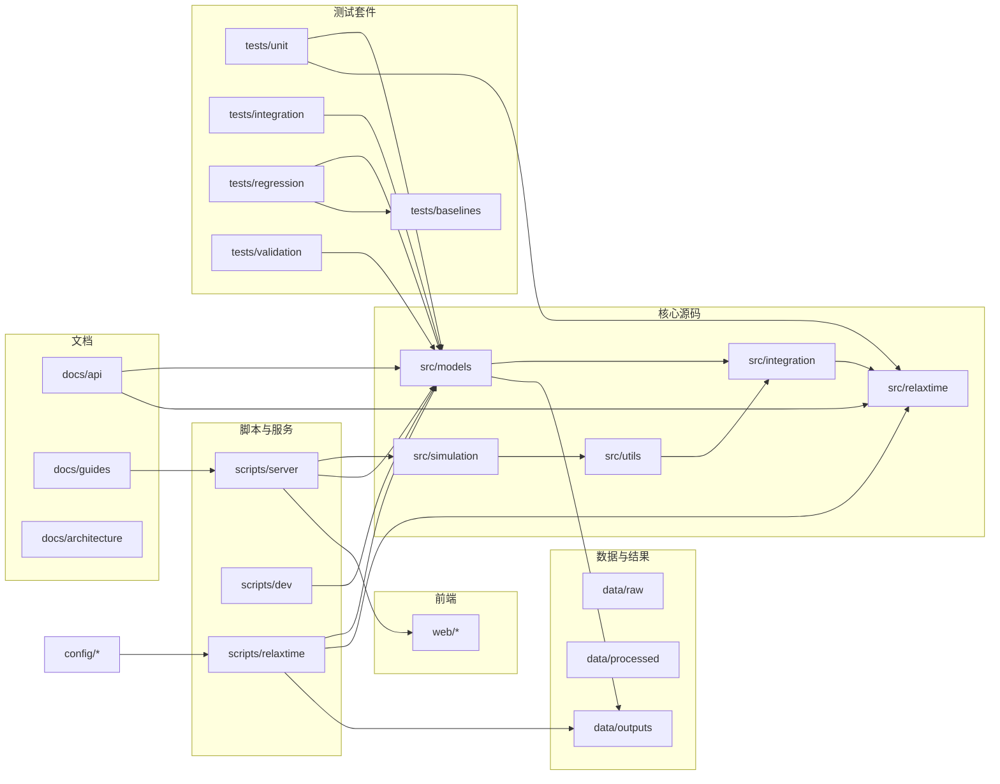
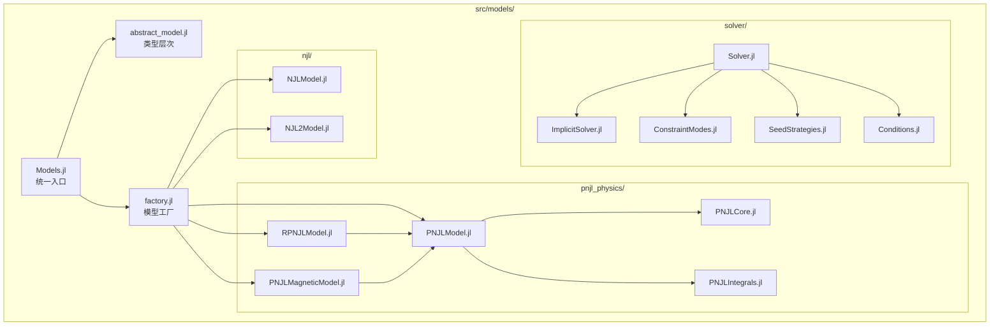
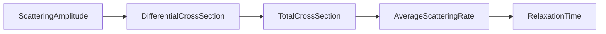
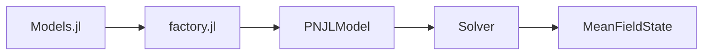
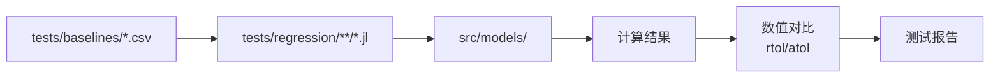

# Dependency graph generated: 2026-08-24T12:59:35.086

Run: julia --project=. scripts/dev/gen_deps.jl

## L1 高层架构图（手动）


```mermaid
flowchart LR
  subgraph Data[数据与结果]
    data_raw[data/raw]
    data_processed[data/processed]
    data_outputs[data/outputs]
  end

  subgraph Docs[文档]
    docs_api[docs/api]
    docs_guides[docs/guides]
    docs_arch[docs/architecture]
  end

  subgraph Source[核心源码]
    src_models[src/models]
    src_utils[src/utils]
    src_integration[src/integration]
    src_simulation[src/simulation]
    src_relaxtime[src/relaxtime]
  end

  subgraph Scripts[脚本与服务]
    scripts_server[scripts/server]
    scripts_dev[scripts/dev]
    scripts_relaxtime[scripts/relaxtime]
  end

  subgraph Tests[测试套件]
    tests_unit[tests/unit]
    tests_integration[tests/integration]
    tests_regression[tests/regression]
    tests_validation[tests/validation]
    tests_baselines[tests/baselines]
  end

  subgraph Web[前端]
    web_static[web/*]
  end

  config[config/*]

  src_utils --> src_integration
  src_models --> src_integration
  src_integration --> src_relaxtime
  src_simulation --> src_utils

  scripts_server --> src_simulation
  scripts_server --> src_models
  scripts_server --> web_static
  scripts_relaxtime --> src_models
  scripts_relaxtime --> src_relaxtime
  scripts_dev --> src_models

  docs_api --> src_models
  docs_api --> src_relaxtime
  docs_guides --> scripts_server

  src_models --> data_outputs
  scripts_relaxtime --> data_outputs

  tests_unit --> src_models
  tests_unit --> src_relaxtime
  tests_integration --> src_models
  tests_regression --> src_models
  tests_regression --> tests_baselines
  tests_validation --> src_models

  config --> scripts_relaxtime
```

## L2 Models 模块架构（基于多重派发）


```mermaid
flowchart TB
  subgraph Models[src/models/]
    Models.jl[Models.jl<br/>统一入口]
    abstract[abstract_model.jl<br/>类型层次]
    factory[factory.jl<br/>模型工厂]

    subgraph NJL[njl/]
      NJLModel[NJLModel.jl]
      NJL2Model[NJL2Model.jl]
    end

    subgraph PNJL[pnjl_physics/]
      PNJLModel[PNJLModel.jl]
      RPNJLModel[RPNJLModel.jl]
      PNJLMagnetic[PNJLMagneticModel.jl]
      PNJLCore[PNJLCore.jl]
      PNJLIntegrals[PNJLIntegrals.jl]
    end

    subgraph Solver[solver/]
      SolverMain[Solver.jl]
      ImplicitSolver[ImplicitSolver.jl]
      ConstraintModes[ConstraintModes.jl]
      SeedStrategies[SeedStrategies.jl]
      Conditions[Conditions.jl]
    end
  end

  Models.jl --> abstract
  Models.jl --> factory
  factory --> NJLModel
  factory --> NJL2Model
  factory --> PNJLModel
  factory --> RPNJLModel
  factory --> PNJLMagnetic

  PNJLModel --> PNJLCore
  PNJLModel --> PNJLIntegrals
  RPNJLModel --> PNJLModel
  PNJLMagnetic --> PNJLModel

  SolverMain --> ImplicitSolver
  SolverMain --> ConstraintModes
  SolverMain --> SeedStrategies
  SolverMain --> Conditions
```

## L3 关键链路补充（手动）

**弛豫时间链路（RTA）**


```mermaid
flowchart LR
  ScatteringAmplitude[ScatteringAmplitude]
    --> DifferentialCrossSection[DifferentialCrossSection]
    --> TotalCrossSection[TotalCrossSection]
    --> AverageScatteringRate[AverageScatteringRate]
    --> RelaxationTime[RelaxationTime]
```

**PNJL 求解链路（新架构）**


```mermaid
flowchart LR
  Models[Models.jl]
    --> Factory[factory.jl]
    --> PNJLModel[PNJLModel]
    --> Solver[Solver]
    --> Result[MeanFieldState]
```

**回归测试链路**


```mermaid
flowchart LR
  Baselines[tests/baselines/*.csv]
    --> RegressionTests[tests/regression/**/*.jl]
    --> Models[src/models/]
    --> Results[计算结果]
    --> Comparison[数值对比<br/>rtol/atol]
    --> Report[测试报告]
```

---



---

```mermaid
%%{init: { 'flowchart': { 'nodeSpacing': 40, 'rankSpacing': 60, 'useMaxWidth': false } }}%%
flowchart LR
  subgraph Constants_PNJL.jl
    src_Constants_PNJL_jl[Constants_PNJL.jl]
  end
  subgraph integration
    src_integration_IntervalQuadratureStrategies_jl[integration/IntervalQuadratureStrategies.jl]
    src_integration_PhaseSpaceSampling_jl[integration/PhaseSpaceSampling.jl]
  end
  subgraph models
    src_models_Models_jl[models/Models.jl]
    src_models_derivatives_ConservedChargeSusceptibilities_jl[models/derivatives/ConservedChargeSusceptibilities.jl]
    src_models_derivatives_MixedTaylorJets_jl[models/derivatives/MixedTaylorJets.jl]
    src_models_derivatives_PNJLChiBTaylorDiff_jl[models/derivatives/PNJLChiBTaylorDiff.jl]
    src_models_derivatives_ThermoDerivatives_jl[models/derivatives/ThermoDerivatives.jl]
    src_models_gas_liquid_core_EquationSet_jl[models/gas_liquid/core/EquationSet.jl]
    src_models_gas_liquid_core_Thermodynamics_jl[models/gas_liquid/core/Thermodynamics.jl]
    src_models_njl_NJL2Core_jl[models/njl/NJL2Core.jl]
    src_models_njl_NJL2Model_jl[models/njl/NJL2Model.jl]
    src_models_njl_NJLCore_jl[models/njl/NJLCore.jl]
    src_models_njl_NJLModel_jl[models/njl/NJLModel.jl]
    src_models_njl_core_NJLCore_jl[models/njl/core/NJLCore.jl]
    src_models_njl2_core_NJL2Core_jl[models/njl2/core/NJL2Core.jl]
    src_models_phase_RhoSupportRefinement_jl[models/phase/RhoSupportRefinement.jl]
    src_models_pnjl_workflows_MesonMassWorkflow_jl[models/pnjl/workflows/MesonMassWorkflow.jl]
    src_models_pnjl_workflows_TransportWorkflow_jl[models/pnjl/workflows/TransportWorkflow.jl]
    src_models_pnjl_physics_PNJLMagneticModel_jl[models/pnjl_physics/PNJLMagneticModel.jl]
    src_models_pnjl_physics_core_MagneticIntegrals_jl[models/pnjl_physics/core/MagneticIntegrals.jl]
    src_models_pnjl_physics_core_MagneticThermodynamics_jl[models/pnjl_physics/core/MagneticThermodynamics.jl]
    src_models_pnjl_physics_core_ModelThermodynamics_jl[models/pnjl_physics/core/ModelThermodynamics.jl]
    src_models_precompile_registry_jl[models/precompile/registry.jl]
    src_models_rotation_core_RotationThermo_jl[models/rotation/core/RotationThermo.jl]
    src_models_scans_CrossoverMesonDensityScan_jl[models/scans/CrossoverMesonDensityScan.jl]
    src_models_scans_ExternalPathMesonDensityScan_jl[models/scans/ExternalPathMesonDensityScan.jl]
    src_models_scans_FlavorChemicalProfiles_jl[models/scans/FlavorChemicalProfiles.jl]
    src_models_scans_FreezeoutMesonDensityScan_jl[models/scans/FreezeoutMesonDensityScan.jl]
    src_models_scans_FreezeoutPathProfiles_jl[models/scans/FreezeoutPathProfiles.jl]
    src_models_scans_FreezeoutPathScan_jl[models/scans/FreezeoutPathScan.jl]
    src_models_scans_FreezeoutProfiles_jl[models/scans/FreezeoutProfiles.jl]
    src_models_scans_MagneticScan_jl[models/scans/MagneticScan.jl]
    src_models_scans_MesonChemicalProfiles_jl[models/scans/MesonChemicalProfiles.jl]
    src_models_scans_MesonMassPathScan_jl[models/scans/MesonMassPathScan.jl]
    src_models_scans_ScanCommon_jl[models/scans/ScanCommon.jl]
    src_models_scans_ScanResultFinalize_jl[models/scans/ScanResultFinalize.jl]
    src_models_scans_TmuScan_jl[models/scans/TmuScan.jl]
    src_models_scans_TrhoScan_jl[models/scans/TrhoScan.jl]
    src_models_solver_orchestrator_SeedStrategies_jl[models/solver/orchestrator/SeedStrategies.jl]
    src_models_solver_spec_Conditions_jl[models/solver/spec/Conditions.jl]
    src_models_variants_gas_liquid_GasLiquidModel_jl[models/variants/gas_liquid/GasLiquidModel.jl]
    src_models_variants_gas_liquid_core_EquationSet_jl[models/variants/gas_liquid/core/EquationSet.jl]
    src_models_variants_gas_liquid_core_Thermodynamics_jl[models/variants/gas_liquid/core/Thermodynamics.jl]
    src_models_variants_gas_liquid_workflows_GasLiquidWorkflow_jl[models/variants/gas_liquid/workflows/GasLiquidWorkflow.jl]
    src_models_variants_rotation_RotationModel_jl[models/variants/rotation/RotationModel.jl]
    src_models_variants_rotation_core_RotationThermo_jl[models/variants/rotation/core/RotationThermo.jl]
    src_models_variants_rotation_workflows_RotationWorkflow_jl[models/variants/rotation/workflows/RotationWorkflow.jl]
    src_models_workflow_apps_MesonDensityWorkflow_jl[models/workflow_apps/MesonDensityWorkflow.jl]
    src_models_workflow_apps_MesonMassWorkflow_jl[models/workflow_apps/MesonMassWorkflow.jl]
    src_models_workflow_apps_MesonThermoWorkflow_jl[models/workflow_apps/MesonThermoWorkflow.jl]
    src_models_workflow_apps_TransportWorkflow_jl[models/workflow_apps/TransportWorkflow.jl]
    src_models_workflow_engine_adapters_RelaxtimeOrchestratorAdapter_jl[models/workflow_engine/adapters/RelaxtimeOrchestratorAdapter.jl]
  end
  subgraph relaxtime
    src_relaxtime_AFieldBuilder_jl[relaxtime/AFieldBuilder.jl]
    src_relaxtime_AverageScatteringRate_jl[relaxtime/AverageScatteringRate.jl]
    src_relaxtime_DifferentialCrossSection_jl[relaxtime/DifferentialCrossSection.jl]
    src_relaxtime_EffectiveCouplings_jl[relaxtime/EffectiveCouplings.jl]
    src_relaxtime_KinematicChecks_jl[relaxtime/KinematicChecks.jl]
    src_relaxtime_MesonDensity_jl[relaxtime/MesonDensity.jl]
    src_relaxtime_MesonMass_jl[relaxtime/MesonMass.jl]
    src_relaxtime_MesonPropagator_jl[relaxtime/MesonPropagator.jl]
    src_relaxtime_MesonThermodynamics_jl[relaxtime/MesonThermodynamics.jl]
    src_relaxtime_MottTransition_jl[relaxtime/MottTransition.jl]
    src_relaxtime_OneLoopIntegrals_jl[relaxtime/OneLoopIntegrals.jl]
    src_relaxtime_OneLoopIntegralsAniso_jl[relaxtime/OneLoopIntegralsAniso.jl]
    src_relaxtime_PolarizationAniso_jl[relaxtime/PolarizationAniso.jl]
    src_relaxtime_PolarizationCache_jl[relaxtime/PolarizationCache.jl]
    src_relaxtime_RelaxTime_jl[relaxtime/RelaxTime.jl]
    src_relaxtime_RelaxationTime_jl[relaxtime/RelaxationTime.jl]
    src_relaxtime_ScatteringAmplitude_jl[relaxtime/ScatteringAmplitude.jl]
    src_relaxtime_TotalCrossSection_jl[relaxtime/TotalCrossSection.jl]
    src_relaxtime_TotalPropagator_jl[relaxtime/TotalPropagator.jl]
    src_relaxtime_TransportCoefficients_jl[relaxtime/TransportCoefficients.jl]
    src_relaxtime_TransportCoefficientsValidation_jl[relaxtime/TransportCoefficientsValidation.jl]
  end
  subgraph root
    AFieldBuilder[AFieldBuilder]
    AbstractSusceptibilityProvider[AbstractSusceptibilityProvider]
    AverageScatteringRate[AverageScatteringRate]
    Conditions[Conditions]
    ConfigLoader[ConfigLoader]
    ConservedChargeSusceptibilities[ConservedChargeSusceptibilities]
    CrossSectionOrchestratedScan[CrossSectionOrchestratedScan]
    CrossoverMesonDensityScan[CrossoverMesonDensityScan]
    DifferentialCrossSection[DifferentialCrossSection]
    EffectiveCouplings[EffectiveCouplings]
    EllipsoidCalculation[EllipsoidCalculation]
    FlavorChemicalProfiles[FlavorChemicalProfiles]
    FrameTransformations[FrameTransformations]
    FreezeoutPathProfiles[FreezeoutPathProfiles]
    FreezeoutPathScan[FreezeoutPathScan]
    FreezeoutProfiles[FreezeoutProfiles]
    FullServerApp[FullServerApp]
    GasLiquidEquationSet[GasLiquidEquationSet]
    GasLiquidThermodynamics[GasLiquidThermodynamics]
    GaussLegendre[GaussLegendre]
    HigherOrderDerivatives[HigherOrderDerivatives]
    IsentropicPathProfiles[IsentropicPathProfiles]
    KinematicChecks[KinematicChecks]
    MagneticIntegrals[MagneticIntegrals]
    MagneticScan[MagneticScan]
    MagneticThermodynamics[MagneticThermodynamics]
    MesonChemicalProfiles[MesonChemicalProfiles]
    MesonDensity[MesonDensity]
    MesonDensityWorkflow[MesonDensityWorkflow]
    MesonMass[MesonMass]
    MesonMassWorkflow[MesonMassWorkflow]
    MesonPropagator[MesonPropagator]
    MesonThermodynamics[MesonThermodynamics]
    MixedTaylorJets[MixedTaylorJets]
    Models[Models]
    MomentumMapping[MomentumMapping]
    MottTransition[MottTransition]
    OneLoopIntegrals[OneLoopIntegrals]
    OneLoopIntegralsCorrection[OneLoopIntegralsCorrection]
    PNJLChiBTaylorDiff[PNJLChiBTaylorDiff]
    PNJLCore[PNJLCore]
    ParticleSymbols[ParticleSymbols]
    PhaseSpaceSampling[PhaseSpaceSampling]
    PolarizationAniso[PolarizationAniso]
    PolarizationCache[PolarizationCache]
    PrecompileRegistry[PrecompileRegistry]
    RelaxationTime[RelaxationTime]
    RotationThermo[RotationThermo]
    ScanCommon[ScanCommon]
    ScanConfig[ScanConfig]
    ScanResultFinalize[ScanResultFinalize]
    ScatteringAmplitude[ScatteringAmplitude]
    SeedStrategies[SeedStrategies]
    ServerWarmup[ServerWarmup]
    TaylorDiffForwardDiffCompat[TaylorDiffForwardDiffCompat]
    ThermoDerivatives[ThermoDerivatives]
    TmuScan[TmuScan]
    TotalCrossSection[TotalCrossSection]
    TotalPropagator[TotalPropagator]
    TransportCoefficients[TransportCoefficients]
    TransportCoefficientsValidation[TransportCoefficientsValidation]
    TransportConstants[TransportConstants]
    TrhoScan[TrhoScan]
    WorkflowConfig[WorkflowConfig]
    WorkflowConfigAudit[WorkflowConfigAudit]
    WorkflowParamAdapters[WorkflowParamAdapters]
  end
  subgraph simulation
    src_simulation_FullServerApp_jl[simulation/FullServerApp.jl]
    src_simulation_HTTPServer_jl[simulation/HTTPServer.jl]
    src_simulation_MomentumMapping_jl[simulation/MomentumMapping.jl]
    src_simulation_ServerLauncher_jl[simulation/ServerLauncher.jl]
  end
  src_Constants_PNJL_jl --> ConfigLoader
  src_Constants_PNJL_jl --> TransportConstants
  src_integration_PhaseSpaceSampling_jl --> GaussLegendre
  src_models_Models_jl --> AbstractSusceptibilityProvider
  src_models_Models_jl --> Conditions
  src_models_Models_jl --> ConservedChargeSusceptibilities
  src_models_Models_jl --> FlavorChemicalProfiles
  src_models_Models_jl --> FreezeoutPathProfiles
  src_models_Models_jl --> FreezeoutPathScan
  src_models_Models_jl --> FreezeoutProfiles
  src_models_Models_jl --> HigherOrderDerivatives
  src_models_Models_jl --> IsentropicPathProfiles
  src_models_Models_jl --> MagneticIntegrals
  src_models_Models_jl --> MagneticScan
  src_models_Models_jl --> MagneticThermodynamics
  src_models_Models_jl --> MesonChemicalProfiles
  src_models_Models_jl --> PrecompileRegistry
  src_models_Models_jl --> SeedStrategies
  src_models_Models_jl --> ThermoDerivatives
  src_models_Models_jl --> TmuScan
  src_models_Models_jl --> TrhoScan
  src_models_derivatives_ConservedChargeSusceptibilities_jl --> Models
  src_models_derivatives_ConservedChargeSusceptibilities_jl --> PNJLChiBTaylorDiff
  src_models_derivatives_ConservedChargeSusceptibilities_jl --> PNJLCore
  src_models_derivatives_MixedTaylorJets_jl --> PNJLCore
  src_models_derivatives_PNJLChiBTaylorDiff_jl --> Conditions
  src_models_derivatives_PNJLChiBTaylorDiff_jl --> MixedTaylorJets
  src_models_derivatives_PNJLChiBTaylorDiff_jl --> Models
  src_models_derivatives_PNJLChiBTaylorDiff_jl --> TaylorDiffForwardDiffCompat
  src_models_derivatives_ThermoDerivatives_jl --> Models
  src_models_derivatives_ThermoDerivatives_jl --> PNJLChiBTaylorDiff
  src_models_derivatives_ThermoDerivatives_jl --> PNJLCore
  src_models_gas_liquid_core_EquationSet_jl --> ConfigLoader
  src_models_gas_liquid_core_Thermodynamics_jl --> GasLiquidEquationSet
  src_models_njl_NJL2Core_jl --> ConfigLoader
  src_models_njl_NJL2Model_jl --> GaussLegendre
  src_models_njl_NJLCore_jl --> ConfigLoader
  src_models_njl_NJLModel_jl --> GaussLegendre
  src_models_njl_core_NJLCore_jl --> ConfigLoader
  src_models_njl2_core_NJL2Core_jl --> ConfigLoader
  src_models_phase_RhoSupportRefinement_jl --> Models
  src_models_pnjl_workflows_MesonMassWorkflow_jl --> Models
  src_models_pnjl_workflows_MesonMassWorkflow_jl --> WorkflowParamAdapters
  src_models_pnjl_workflows_TransportWorkflow_jl --> Models
  src_models_pnjl_workflows_TransportWorkflow_jl --> TransportCoefficients
  src_models_pnjl_workflows_TransportWorkflow_jl --> WorkflowParamAdapters
  src_models_pnjl_physics_PNJLMagneticModel_jl --> Models
  src_models_pnjl_physics_core_MagneticThermodynamics_jl --> MagneticIntegrals
  src_models_pnjl_physics_core_MagneticThermodynamics_jl --> src_models_pnjl_physics_core_MagneticIntegrals_jl
  src_models_pnjl_physics_core_ModelThermodynamics_jl --> Models
  src_models_precompile_registry_jl --> Models
  src_models_rotation_core_RotationThermo_jl --> ConfigLoader
  src_models_scans_CrossoverMesonDensityScan_jl --> FlavorChemicalProfiles
  src_models_scans_CrossoverMesonDensityScan_jl --> MesonChemicalProfiles
  src_models_scans_CrossoverMesonDensityScan_jl --> MesonDensityWorkflow
  src_models_scans_CrossoverMesonDensityScan_jl --> Models
  src_models_scans_CrossoverMesonDensityScan_jl --> ScanCommon
  src_models_scans_ExternalPathMesonDensityScan_jl --> CrossoverMesonDensityScan
  src_models_scans_ExternalPathMesonDensityScan_jl --> FlavorChemicalProfiles
  src_models_scans_ExternalPathMesonDensityScan_jl --> MesonChemicalProfiles
  src_models_scans_ExternalPathMesonDensityScan_jl --> ScanCommon
  src_models_scans_FlavorChemicalProfiles_jl --> ConfigLoader
  src_models_scans_FreezeoutMesonDensityScan_jl --> FlavorChemicalProfiles
  src_models_scans_FreezeoutMesonDensityScan_jl --> FreezeoutPathProfiles
  src_models_scans_FreezeoutMesonDensityScan_jl --> FreezeoutProfiles
  src_models_scans_FreezeoutMesonDensityScan_jl --> MesonChemicalProfiles
  src_models_scans_FreezeoutMesonDensityScan_jl --> MesonDensityWorkflow
  src_models_scans_FreezeoutMesonDensityScan_jl --> ScanCommon
  src_models_scans_FreezeoutPathProfiles_jl --> ConfigLoader
  src_models_scans_FreezeoutPathProfiles_jl --> FreezeoutProfiles
  src_models_scans_FreezeoutPathScan_jl --> FreezeoutPathProfiles
  src_models_scans_FreezeoutPathScan_jl --> FreezeoutProfiles
  src_models_scans_FreezeoutPathScan_jl --> Models
  src_models_scans_FreezeoutPathScan_jl --> ScanCommon
  src_models_scans_FreezeoutPathScan_jl --> ScanConfig
  src_models_scans_FreezeoutPathScan_jl --> SeedStrategies
  src_models_scans_FreezeoutPathScan_jl --> TmuScan
  src_models_scans_FreezeoutProfiles_jl --> ConfigLoader
  src_models_scans_MagneticScan_jl --> Models
  src_models_scans_MesonChemicalProfiles_jl --> ConfigLoader
  src_models_scans_MesonMassPathScan_jl --> FreezeoutPathProfiles
  src_models_scans_MesonMassPathScan_jl --> FreezeoutProfiles
  src_models_scans_MesonMassPathScan_jl --> IsentropicPathProfiles
  src_models_scans_MesonMassPathScan_jl --> MesonMassWorkflow
  src_models_scans_MesonMassPathScan_jl --> Models
  src_models_scans_MesonMassPathScan_jl --> ScanCommon
  src_models_scans_ScanCommon_jl --> Models
  src_models_scans_ScanCommon_jl --> SeedStrategies
  src_models_scans_ScanResultFinalize_jl --> Models
  src_models_scans_TmuScan_jl --> Models
  src_models_scans_TmuScan_jl --> ScanCommon
  src_models_scans_TmuScan_jl --> ScanConfig
  src_models_scans_TmuScan_jl --> ScanResultFinalize
  src_models_scans_TmuScan_jl --> SeedStrategies
  src_models_scans_TrhoScan_jl --> Models
  src_models_scans_TrhoScan_jl --> ScanCommon
  src_models_scans_TrhoScan_jl --> ScanConfig
  src_models_scans_TrhoScan_jl --> ScanResultFinalize
  src_models_scans_TrhoScan_jl --> SeedStrategies
  src_models_solver_orchestrator_SeedStrategies_jl --> Models
  src_models_solver_spec_Conditions_jl --> Models
  src_models_variants_gas_liquid_GasLiquidModel_jl --> GasLiquidEquationSet
  src_models_variants_gas_liquid_GasLiquidModel_jl --> GasLiquidThermodynamics
  src_models_variants_gas_liquid_core_EquationSet_jl --> ConfigLoader
  src_models_variants_gas_liquid_core_EquationSet_jl --> GaussLegendre
  src_models_variants_gas_liquid_core_Thermodynamics_jl --> GasLiquidEquationSet
  src_models_variants_gas_liquid_workflows_GasLiquidWorkflow_jl --> GasLiquidEquationSet
  src_models_variants_gas_liquid_workflows_GasLiquidWorkflow_jl --> GasLiquidThermodynamics
  src_models_variants_gas_liquid_workflows_GasLiquidWorkflow_jl --> Models
  src_models_variants_rotation_RotationModel_jl --> RotationThermo
  src_models_variants_rotation_core_RotationThermo_jl --> ConfigLoader
  src_models_variants_rotation_workflows_RotationWorkflow_jl --> Models
  src_models_variants_rotation_workflows_RotationWorkflow_jl --> RotationThermo
  src_models_workflow_apps_MesonDensityWorkflow_jl --> MesonMassWorkflow
  src_models_workflow_apps_MesonDensityWorkflow_jl --> WorkflowParamAdapters
  src_models_workflow_apps_MesonMassWorkflow_jl --> Models
  src_models_workflow_apps_MesonMassWorkflow_jl --> WorkflowParamAdapters
  src_models_workflow_apps_MesonThermoWorkflow_jl --> MesonMassWorkflow
  src_models_workflow_apps_MesonThermoWorkflow_jl --> Models
  src_models_workflow_apps_MesonThermoWorkflow_jl --> WorkflowParamAdapters
  src_models_workflow_apps_TransportWorkflow_jl --> Models
  src_models_workflow_apps_TransportWorkflow_jl --> TransportCoefficients
  src_models_workflow_apps_TransportWorkflow_jl --> WorkflowParamAdapters
  src_models_workflow_engine_adapters_RelaxtimeOrchestratorAdapter_jl --> CrossSectionOrchestratedScan
  src_models_workflow_engine_adapters_RelaxtimeOrchestratorAdapter_jl --> WorkflowConfig
  src_models_workflow_engine_adapters_RelaxtimeOrchestratorAdapter_jl --> WorkflowConfigAudit
  src_relaxtime_AFieldBuilder_jl --> GaussLegendre
  src_relaxtime_AFieldBuilder_jl --> OneLoopIntegrals
  src_relaxtime_AFieldBuilder_jl --> OneLoopIntegralsCorrection
  src_relaxtime_AverageScatteringRate_jl --> AFieldBuilder
  src_relaxtime_AverageScatteringRate_jl --> GaussLegendre
  src_relaxtime_AverageScatteringRate_jl --> ParticleSymbols
  src_relaxtime_AverageScatteringRate_jl --> TotalCrossSection
  src_relaxtime_DifferentialCrossSection_jl --> KinematicChecks
  src_relaxtime_EffectiveCouplings_jl --> OneLoopIntegrals
  src_relaxtime_EffectiveCouplings_jl --> OneLoopIntegralsCorrection
  src_relaxtime_MesonDensity_jl --> AFieldBuilder
  src_relaxtime_MesonDensity_jl --> EffectiveCouplings
  src_relaxtime_MesonDensity_jl --> GaussLegendre
  src_relaxtime_MesonDensity_jl --> MesonMass
  src_relaxtime_MesonDensity_jl --> MesonPropagator
  src_relaxtime_MesonDensity_jl --> PolarizationAniso
  src_relaxtime_MesonMass_jl --> AFieldBuilder
  src_relaxtime_MesonMass_jl --> EffectiveCouplings
  src_relaxtime_MesonMass_jl --> GaussLegendre
  src_relaxtime_MesonMass_jl --> PolarizationAniso
  src_relaxtime_MesonPropagator_jl --> EffectiveCouplings
  src_relaxtime_MesonPropagator_jl --> ParticleSymbols
  src_relaxtime_MesonThermodynamics_jl --> AFieldBuilder
  src_relaxtime_MesonThermodynamics_jl --> GaussLegendre
  src_relaxtime_MesonThermodynamics_jl --> MesonDensity
  src_relaxtime_OneLoopIntegrals_jl --> GaussLegendre
  src_relaxtime_OneLoopIntegrals_jl --> src_integration_IntervalQuadratureStrategies_jl
  src_relaxtime_OneLoopIntegralsAniso_jl --> GaussLegendre
  src_relaxtime_OneLoopIntegralsAniso_jl --> OneLoopIntegrals
  src_relaxtime_OneLoopIntegralsAniso_jl --> src_integration_IntervalQuadratureStrategies_jl
  src_relaxtime_PolarizationAniso_jl --> OneLoopIntegrals
  src_relaxtime_PolarizationAniso_jl --> OneLoopIntegralsCorrection
  src_relaxtime_PolarizationCache_jl --> PolarizationAniso
  src_relaxtime_RelaxTime_jl --> AFieldBuilder
  src_relaxtime_RelaxTime_jl --> AverageScatteringRate
  src_relaxtime_RelaxTime_jl --> DifferentialCrossSection
  src_relaxtime_RelaxTime_jl --> EffectiveCouplings
  src_relaxtime_RelaxTime_jl --> KinematicChecks
  src_relaxtime_RelaxTime_jl --> MesonDensity
  src_relaxtime_RelaxTime_jl --> MesonMass
  src_relaxtime_RelaxTime_jl --> MesonPropagator
  src_relaxtime_RelaxTime_jl --> MesonThermodynamics
  src_relaxtime_RelaxTime_jl --> MottTransition
  src_relaxtime_RelaxTime_jl --> OneLoopIntegrals
  src_relaxtime_RelaxTime_jl --> OneLoopIntegralsCorrection
  src_relaxtime_RelaxTime_jl --> PolarizationAniso
  src_relaxtime_RelaxTime_jl --> PolarizationCache
  src_relaxtime_RelaxTime_jl --> RelaxationTime
  src_relaxtime_RelaxTime_jl --> ScatteringAmplitude
  src_relaxtime_RelaxTime_jl --> TotalCrossSection
  src_relaxtime_RelaxTime_jl --> TotalPropagator
  src_relaxtime_RelaxTime_jl --> TransportCoefficients
  src_relaxtime_RelaxTime_jl --> src_relaxtime_AFieldBuilder_jl
  src_relaxtime_RelaxTime_jl --> src_relaxtime_AverageScatteringRate_jl
  src_relaxtime_RelaxTime_jl --> src_relaxtime_DifferentialCrossSection_jl
  src_relaxtime_RelaxTime_jl --> src_relaxtime_EffectiveCouplings_jl
  src_relaxtime_RelaxTime_jl --> src_relaxtime_KinematicChecks_jl
  src_relaxtime_RelaxTime_jl --> src_relaxtime_MesonDensity_jl
  src_relaxtime_RelaxTime_jl --> src_relaxtime_MesonMass_jl
  src_relaxtime_RelaxTime_jl --> src_relaxtime_MesonPropagator_jl
  src_relaxtime_RelaxTime_jl --> src_relaxtime_MesonThermodynamics_jl
  src_relaxtime_RelaxTime_jl --> src_relaxtime_MottTransition_jl
  src_relaxtime_RelaxTime_jl --> src_relaxtime_OneLoopIntegrals_jl
  src_relaxtime_RelaxTime_jl --> src_relaxtime_OneLoopIntegralsAniso_jl
  src_relaxtime_RelaxTime_jl --> src_relaxtime_PolarizationAniso_jl
  src_relaxtime_RelaxTime_jl --> src_relaxtime_PolarizationCache_jl
  src_relaxtime_RelaxTime_jl --> src_relaxtime_RelaxationTime_jl
  src_relaxtime_RelaxTime_jl --> src_relaxtime_ScatteringAmplitude_jl
  src_relaxtime_RelaxTime_jl --> src_relaxtime_TotalCrossSection_jl
  src_relaxtime_RelaxTime_jl --> src_relaxtime_TotalPropagator_jl
  src_relaxtime_RelaxTime_jl --> src_relaxtime_TransportCoefficients_jl
  src_relaxtime_RelaxTime_jl --> src_relaxtime_TransportCoefficientsValidation_jl
  src_relaxtime_RelaxationTime_jl --> AFieldBuilder
  src_relaxtime_RelaxationTime_jl --> AverageScatteringRate
  src_relaxtime_RelaxationTime_jl --> TotalCrossSection
  src_relaxtime_ScatteringAmplitude_jl --> ParticleSymbols
  src_relaxtime_ScatteringAmplitude_jl --> TotalPropagator
  src_relaxtime_TotalCrossSection_jl --> DifferentialCrossSection
  src_relaxtime_TotalCrossSection_jl --> GaussLegendre
  src_relaxtime_TotalCrossSection_jl --> KinematicChecks
  src_relaxtime_TotalCrossSection_jl --> OneLoopIntegrals
  src_relaxtime_TotalCrossSection_jl --> ParticleSymbols
  src_relaxtime_TotalCrossSection_jl --> ScatteringAmplitude
  src_relaxtime_TotalPropagator_jl --> KinematicChecks
  src_relaxtime_TotalPropagator_jl --> MesonPropagator
  src_relaxtime_TotalPropagator_jl --> ParticleSymbols
  src_relaxtime_TotalPropagator_jl --> PolarizationCache
  src_relaxtime_TransportCoefficients_jl --> GaussLegendre
  src_relaxtime_TransportCoefficients_jl --> PhaseSpaceSampling
  src_relaxtime_TransportCoefficients_jl --> TransportCoefficientsValidation
  src_simulation_FullServerApp_jl --> MomentumMapping
  src_simulation_HTTPServer_jl --> MomentumMapping
  src_simulation_MomentumMapping_jl --> EllipsoidCalculation
  src_simulation_MomentumMapping_jl --> FrameTransformations
  src_simulation_ServerLauncher_jl --> FullServerApp
  src_simulation_ServerLauncher_jl --> ServerWarmup
```

