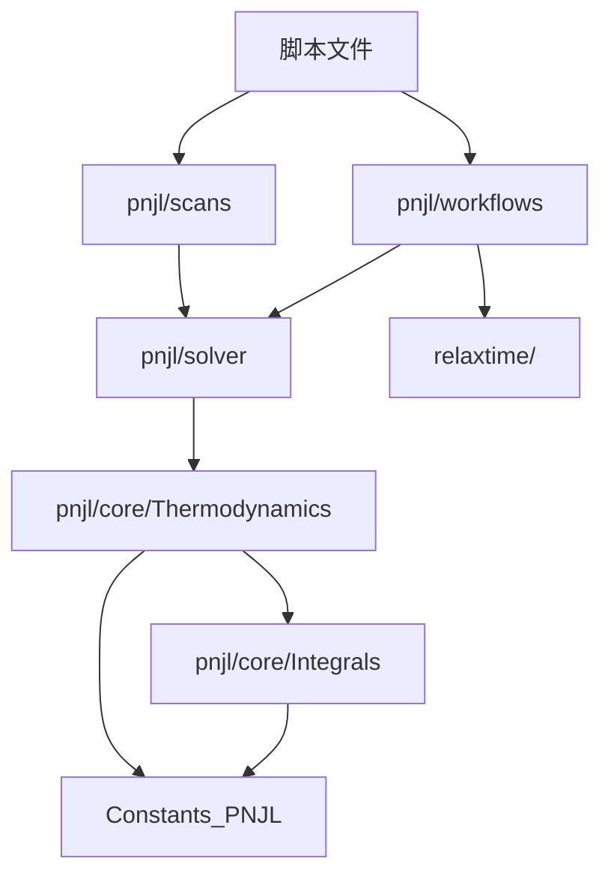
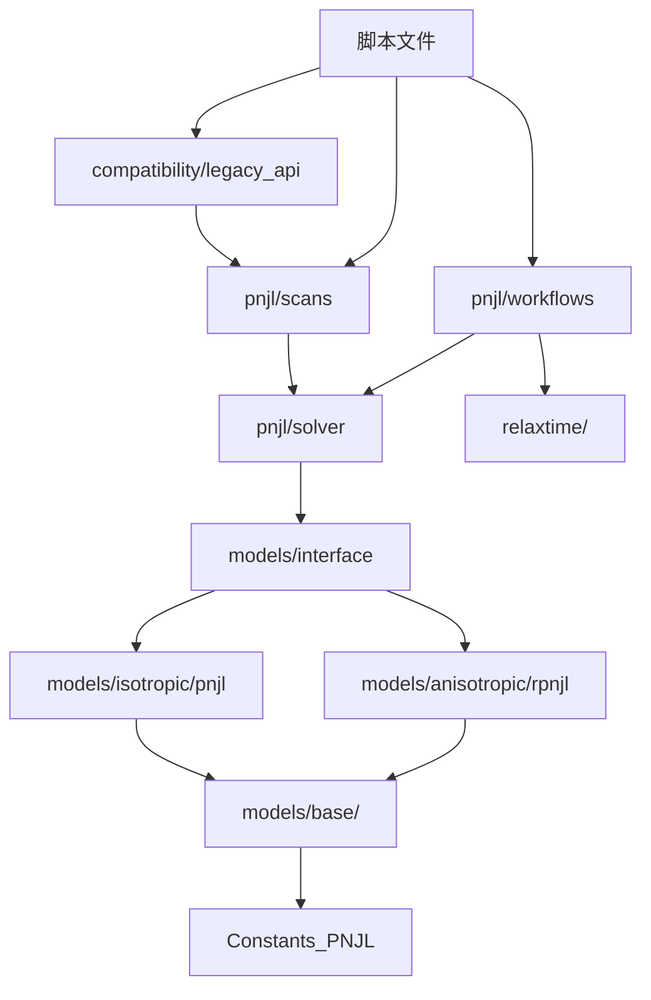

# QCD模型架构重构依赖关系分析

## 概述

本文档分析QCD模型库架构重构对现有代码的影响，识别所有受影响的模块和调用点，制定并行开发协调策略。

**重构范围**：将单体PNJL实现重构为多态架构（AbstractQCDModel + 具体模型实现）

**生成日期**：2026-02-01  
**状态**：规划阶段

## 2026-02-20 迁移状态补充（执行对齐）

- 已明确边界：`src/models/*` 作为模型层，`src/pnjl/scans/*`、`src/pnjl/workflows/*`、`src/simulation/*` 作为流程层。
- 本阶段不执行 `src/pnjl` 全量搬迁；采用“模型内核收敛 + 流程层稳定入口保留”的渐进策略。
- 已保留双后端策略（`:legacy | :models`）作为回归与回退手段。
- 后续删除 legacy 实体文件前，先完成“裁剪候选清单 + 定向回归 + smoke 全绿”的门槛校验。

## 2026-02-21 下一阶段计划（全量迁移）

- 已新增执行任务单：`docs/dev/active/2026-02-21_新架构全量迁移实施任务单.md`。
- 下一阶段目标：以 Julia 多重派发为核心，完成 models 主路径承载并分波次移出 `src/pnjl` 模块。
- 执行原则：先接口冻结与去耦，再流程薄层化，最后按门禁裁剪 legacy 实体。

---

## 1. 重构影响范围

### 1.1 核心变更模块

#### 新增模块
```
src/core/
├── interface.jl          # AbstractQCDModel及必需方法签名
└── exceptions.jl         # 自定义异常类型（新增）

src/models/
├── base/                 # 共享工具（重构自src/pnjl/core/）
│   ├── integrals.jl
│   ├── polyakov.jl
│   ├── safe_math.jl
│   ├── distributions.jl
│   ├── mass_chiral.jl
│   └── validation.jl     # 参数验证（新增）
├── isotropic/
│   ├── types.jl          # AbstractIsotropicModel
│   └── pnjl.jl           # PNJLModel实现（重构）
├── anisotropic/
│   ├── types.jl          # AbstractAnisotropicModel
│   └── rpnjl.jl          # RPNJLModel实现（新增）
├── magnetic/
│   └── types.jl          # AbstractMagneticModel
├── factory.jl            # 模型工厂
└── interface.jl          # 接口加载器

src/compatibility/
└── legacy_api.jl         # 向后兼容层（新增）
```

#### 重构模块
```
src/pnjl/core/
├── Thermodynamics.jl     # 部分函数迁移到models/base/
├── Integrals.jl          # 迁移到models/base/integrals.jl
└── Core.jl               # 保留，但调用新接口

src/pnjl/solver/
├── Solver.jl             # 更新为接受model参数
├── ImplicitSolver.jl     # 更新为接受model参数
├── Conditions.jl         # 更新为使用model接口
└── SeedStrategies.jl     # 更新为使用model接口

src/pnjl/scans/
├── TmuScan.jl            # 更新为使用model实例
├── TrhoScan.jl           # 更新为使用model实例
└── DualBranchScan.jl     # 更新为使用model实例

src/pnjl/workflows/
├── MesonMassWorkflow.jl  # 更新为使用model实例
└── TransportWorkflow.jl  # 更新为使用model实例
```

### 1.2 不受影响模块

```
src/relaxtime/            # 不直接依赖PNJL内部实现
src/integration/          # 独立的数值工具
src/simulation/           # 独立的服务接口
src/utils/                # 通用工具
```

---

## 2. 调用点识别

### 2.1 直接调用点（需要更新）

#### 2.1.1 Thermodynamics模块调用

**当前调用方式**：
```julia
using .Thermodynamics: calculate_mass_vec, calculate_chiral, calculate_U

masses = calculate_mass_vec(φ)
chi = calculate_chiral(φ)
U = calculate_U(T, Φ, Φbar)
```

**受影响文件**：
- `src/pnjl/solver/Conditions.jl` - gap方程定义
- `src/pnjl/solver/ImplicitSolver.jl` - 求解器
- `src/pnjl/scans/TmuScan.jl` - T-μ扫描
- `src/pnjl/scans/TrhoScan.jl` - T-ρ扫描
- `src/pnjl/scans/DualBranchScan.jl` - 双分支扫描
- `src/pnjl/derivatives/ThermoDerivatives.jl` - 热力学导数
- `src/pnjl/workflows/MesonMassWorkflow.jl` - 介子质量工作流
- `src/pnjl/workflows/TransportWorkflow.jl` - 输运工作流

**迁移策略**：
1. 阶段1：添加兼容层，保持旧调用方式工作
2. 阶段2：逐步更新为新接口（model参数）
3. 阶段3：移除兼容层

#### 2.1.2 Integrals模块调用

**当前调用方式**：
```julia
using .Integrals: calculate_energy_sum, calculate_log_sum

energy = calculate_energy_sum(masses)
log_term = calculate_log_sum(masses, nodes, Φ, Φbar, mu, T, xi)
```

**受影响文件**：
- `src/pnjl/core/Thermodynamics.jl` - 热力学计算
- `src/pnjl/derivatives/ThermoDerivatives.jl` - 导数计算

**迁移策略**：
- 将函数移动到`src/models/base/integrals.jl`
- 更新import路径
- 保持函数签名不变（向后兼容）

#### 2.1.3 常量引用

**当前调用方式**：
```julia
using Main.Constants_PNJL: G_fm2, K_fm5, T0_inv_fm, a0, a1, a2, b3
```

**受影响文件**：
- `src/pnjl/core/Thermodynamics.jl`
- `src/pnjl/solver/Conditions.jl`

**迁移策略**：
- 将常量封装到模型参数中
- 通过`model.params`访问
- 保留全局常量作为默认值

### 2.2 间接调用点（可能受影响）

#### 2.2.1 脚本文件

**扫描脚本**：
```
scripts/pnjl/
├── run_solver_smoke.jl
├── run_solver_tmu.jl
├── run_tmu_scan.jl
├── run_dense_trho_scan.jl
├── run_adaptive_trho_scan.jl
├── calculate_derivatives.jl
├── calculate_phase_structure.jl
└── ...
```

**影响评估**：
- 大多数脚本通过高层API调用（如`run_tmu_scan`）
- 高层API提供兼容层后，脚本无需修改
- 少数直接调用底层函数的脚本需要更新

**迁移策略**：
- 优先级：P2（在核心重构完成后）
- 提供迁移示例脚本
- 在文档中说明新旧用法对比

#### 2.2.2 测试文件

**单元测试**：
```
tests/unit/pnjl/
├── test_core_thermodynamics.jl
├── test_core_integrals.jl
├── test_solver_conditions.jl
├── test_solver_implicit.jl
├── test_scans.jl
└── ...
```

**影响评估**：
- 所有测试需要更新以使用新接口
- 需要新增模型接口的测试
- 需要新增兼容层的测试

**迁移策略**：
- 创建新的测试目录`tests/unit/models/`
- 保留旧测试作为回归测试
- 新测试使用新接口

---

## 3. 依赖关系图

### 3.1 当前依赖关系



### 3.2 重构后依赖关系



### 3.3 关键依赖路径

**路径1：脚本 → 扫描 → 求解器 → 模型**
- 影响：高
- 策略：通过兼容层隔离变更

**路径2：工作流 → 求解器 → 模型**
- 影响：中
- 策略：逐步迁移，保持接口稳定

**路径3：测试 → 所有模块**
- 影响：高
- 策略：并行开发新旧测试

---

## 4. 并行开发协调策略

### 4.1 开发阶段划分

#### 阶段0：准备阶段（1天）
- 创建`feature/qcd-model-refactoring`分支
- 设置CI配置
- 创建基础目录结构
- 通知团队成员

#### 阶段1：核心接口和基础工具（3-4天）
**开发内容**：
- `src/core/interface.jl`
- `src/core/exceptions.jl`
- `src/models/base/` 所有模块
- `src/models/isotropic/types.jl`
- `src/models/anisotropic/types.jl`
- `src/models/magnetic/types.jl`

**并行开发规则**：
- ✅ 可以并行：其他模块的bug修复
- ❌ 禁止并行：修改`src/pnjl/core/`中的函数签名
- ⚠️ 需协调：新增`src/pnjl/`下的功能

**协调机制**：
- 每日同步会议（15分钟）
- 在Slack/Teams频道通报进度
- 重要变更提前通知

#### 阶段2：PNJL模型重构（3-4天）
**开发内容**：
- `src/models/isotropic/pnjl.jl`
- `src/compatibility/legacy_api.jl`
- 更新`src/pnjl/solver/`模块
- 回归测试

**并行开发规则**：
- ✅ 可以并行：`src/relaxtime/`的开发
- ✅ 可以并行：文档更新
- ❌ 禁止并行：修改`src/pnjl/solver/`
- ⚠️ 需协调：修改`src/pnjl/scans/`

**协调机制**：
- 兼容层完成后通知团队
- 提供迁移示例代码
- 更新开发文档

#### 阶段3：rPNJL模型实现（4-5天）
**开发内容**：
- `src/models/anisotropic/rpnjl.jl`
- 八夸克项实现
- Vandermonde项实现
- rPNJL测试

**并行开发规则**：
- ✅ 可以并行：所有其他模块
- ✅ 可以并行：脚本迁移
- ⚠️ 需协调：如果需要修改base工具

**协调机制**：
- 独立分支开发
- 定期合并主重构分支
- 代码审查

#### 阶段4：扫描器和工作流更新（3-4天）
**开发内容**：
- 更新`src/pnjl/scans/`
- 更新`src/pnjl/workflows/`
- 更新脚本文件
- 集成测试

**并行开发规则**：
- ✅ 可以并行：文档完善
- ✅ 可以并行：性能优化
- ❌ 禁止并行：修改模型接口

**协调机制**：
- 提供迁移检查清单
- 代码审查重点关注兼容性

#### 阶段5：测试和文档（2-3天）
**开发内容**：
- 完整测试套件
- 性能基准测试
- API文档
- 迁移指南
- 示例代码

**并行开发规则**：
- ✅ 可以并行：所有文档工作
- ✅ 可以并行：测试编写
- ❌ 禁止并行：代码变更（功能冻结）

**协调机制**：
- 功能冻结通知
- 文档审查
- 发布准备

### 4.2 冲突预防机制

#### 代码层面
1. **模块化隔离**：新代码在新目录，减少文件冲突
2. **接口先行**：先定义接口，再实现细节
3. **兼容层缓冲**：通过兼容层隔离新旧代码

#### 流程层面
1. **每日同步**：15分钟站会，通报进度和计划
2. **变更通知**：重要变更提前在频道通知
3. **代码审查**：所有PR必须经过审查

#### 工具层面
1. **分支策略**：使用feature分支，定期合并develop
2. **CI检查**：自动检测冲突和测试失败
3. **文档同步**：变更同时更新文档

### 4.3 紧急情况处理

#### 生产环境Bug
**场景**：重构期间发现生产环境严重bug

**处理流程**：
1. 从`main`创建`hotfix/`分支
2. 修复bug并测试
3. 合并到`main`和`develop`
4. 重构分支rebase `develop`
5. 解决冲突后继续

#### 重构阻塞
**场景**：重构遇到技术难题，无法按计划推进

**处理流程**：
1. 评估影响范围和延期时间
2. 通知团队和利益相关者
3. 调整计划或寻求帮助
4. 记录决策和原因（ADR）

#### 需求变更
**场景**：重构期间有新的紧急需求

**处理流程**：
1. 评估是否可以等待重构完成
2. 如果紧急，在`develop`分支开发
3. 重构分支定期合并`develop`
4. 解决冲突，确保兼容

---

## 5. 迁移检查清单

### 5.1 模块迁移检查

对于每个需要更新的模块：

- [ ] 识别所有对旧接口的调用
- [ ] 更新为新接口调用
- [ ] 添加model参数（如需要）
- [ ] 更新import语句
- [ ] 更新函数签名
- [ ] 更新文档字符串
- [ ] 运行单元测试
- [ ] 运行集成测试
- [ ] 更新相关文档

### 5.2 脚本迁移检查

对于每个脚本文件：

- [ ] 确认是否使用兼容层
- [ ] 如果直接调用，更新为新接口
- [ ] 测试脚本运行
- [ ] 验证输出结果一致
- [ ] 更新脚本文档

### 5.3 测试迁移检查

对于每个测试文件：

- [ ] 创建对应的新测试文件
- [ ] 使用新接口编写测试
- [ ] 保留旧测试作为回归测试
- [ ] 验证测试覆盖率
- [ ] 更新测试文档

---

## 6. 风险评估

### 6.1 高风险项

| 风险 | 影响 | 概率 | 缓解措施 |
|------|------|------|----------|
| 遗漏调用点更新 | 高 | 中 | 全面的代码搜索，完整的测试覆盖 |
| 数值结果不一致 | 高 | 低 | 回归测试，逐点对比 |
| 性能显著下降 | 高 | 低 | 性能基准测试，优化关键路径 |
| 兼容层bug | 中 | 中 | 充分测试兼容层，提供回退方案 |

### 6.2 中风险项

| 风险 | 影响 | 概率 | 缓解措施 |
|------|------|------|----------|
| 并行开发冲突 | 中 | 中 | 每日同步，清晰的协调机制 |
| 文档不同步 | 中 | 高 | 代码和文档同步更新，审查检查 |
| 测试覆盖不足 | 中 | 中 | 测试计划，覆盖率要求 |
| 迁移工作量低估 | 中 | 中 | 预留缓冲时间，灵活调整 |

### 6.3 低风险项

| 风险 | 影响 | 概率 | 缓解措施 |
|------|------|------|----------|
| 命名冲突 | 低 | 低 | 命名规范，代码审查 |
| 依赖版本问题 | 低 | 低 | 锁定依赖版本 |
| CI配置问题 | 低 | 低 | 提前测试CI配置 |

---

## 7. 进度跟踪

### 7.1 里程碑

| 里程碑 | 预计完成日期 | 交付物 | 状态 |
|--------|-------------|--------|------|
| M1: 核心接口完成 | Day 4 | interface.jl, base/ | 🔲 未开始 |
| M2: PNJL重构完成 | Day 8 | pnjl.jl, 兼容层 | 🔲 未开始 |
| M3: rPNJL实现完成 | Day 13 | rpnjl.jl | 🔲 未开始 |
| M4: 扫描器更新完成 | Day 17 | 更新的scans/ | 🔲 未开始 |
| M5: 测试和文档完成 | Day 20 | 完整测试套件，文档 | 🔲 未开始 |

### 7.2 每日进度报告模板

```markdown
## 日期：YYYY-MM-DD

### 完成的工作
- [ ] 任务1
- [ ] 任务2

### 遇到的问题
- 问题描述
- 解决方案或需要的帮助

### 明天的计划
- [ ] 任务1
- [ ] 任务2

### 需要协调的事项
- 事项1
- 事项2
```

---

## 8. 参考资料

- 架构设计规范：`docs/dev/active/2026_02_01_QCD模型库架构设计规范.md`
- 实施计划：`docs/dev/active/2026_02_01_QCD模型库开发实施计划.md`
- 分支策略：`docs/dev/branching_strategy.md`
- 错误处理指南：`docs/guides/error_handling.md`
- 数据契约：`docs/api/data_contracts.md`

---

## 9. 更新日志

| 日期 | 版本 | 变更内容 | 作者 |
|------|------|----------|------|
| 2026-02-01 | 1.0 | 初始版本 | Kiro AI |

---

**注意**：本文档应在重构过程中持续更新，记录实际的依赖关系变化和遇到的问题。
