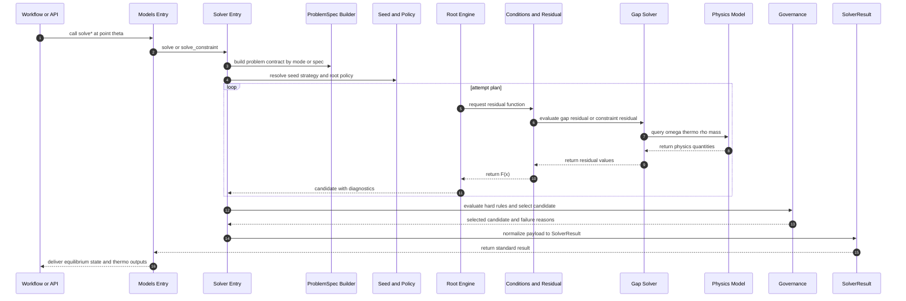
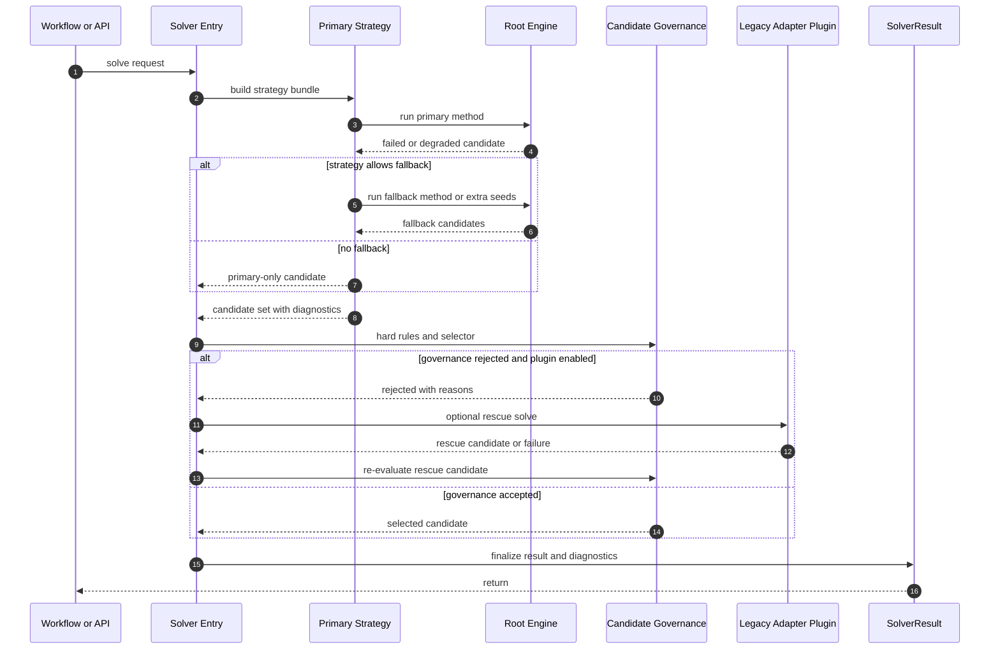

# 项目级 Solver 时序图（workflow -> solver -> physics -> result）

更新日期：2026-04-06

## 1. 主时序（当前实现视角）

## 2. 分层责任映射（与时序对应）

- `Workflow/API`：给定控制参数，发起点求解或扫描。
- `Models Entry`：统一外部调用入口，屏蔽内部实现差异。
- `Solver Entry`：参数归一化、调度链路组织、结果标准化。
- `ProblemSpec`：构造约束问题契约（当前为 mode 主导，后续可 spec-first）。
- `Seed and Policy`：设置初值策略、容差与 fallback 规则。
- `Root Engine`：执行主方法与回退策略，产出尝试诊断。
- `Conditions and Residual`：将物理约束转译为可求解残差。
- `Gap Solver + Physics Model`：完成具体物理量计算与方程评估。
- `Governance`：做硬约束过滤、候选择优和失败归因。
- `SolverResult`：输出统一结构供上层 workflow 复用。

## 3. 可用于评审的简化口径

一句话：

- Solver 在项目中的作用是把“物理约束定义”转换成“可治理的数值求解流程”，并稳定交付统一格式的平衡态结果给上层业务链路。

## 4. 异常分支时序（主方法失败路径）

