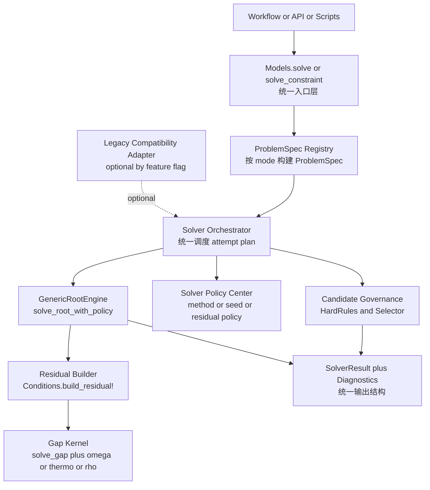

以下为原始内容（保留，以便审阅与历史参考）：

---

# Solver 目标态架构图（To-Be Blueprint）

更新日期：2026-04-06

## 1. 目标与范围

- 目标：将 solver 能力统一收敛到 `Models.solve / solve_constraint` 主链。
- 范围：`src/models/solver/*`、`src/models/constraint_solver.jl`、`src/models/gap_solver.jl`、`src/models/implicit_gap.jl`。
- 非目标：本文件不定义具体代码改动顺序与测试执行细节，仅给出目标态蓝图用于后续能力范围讨论。

## 2. 目标态设计原则

- 单一入口：保持 `Models.solve / solve_constraint` 为唯一对外入口。
- 单一主链：所有 mode（含 `FixedMu`）统一走 `ProblemSpec -> Orchestrator -> RootEngine`。
- 单一策略中心：seed/method fallback/residual 阈值/hard rules 统一配置化。
- 兼容层可拔插：legacy fallback 仅在 compatibility adapter 中可选启用，主链不直接依赖。

## 3. 目标态架构图

## 4. 逻辑分层与职责

### 4.1 入口层（Entry）

- 职责：参数标准化、mode 分发、结果标准化。
- 接口：`solve`、`solve_constraint`、`solve_multi`。

### 4.2 问题规格层（ProblemSpec Registry）

- 职责：把 mode 转成统一问题契约（维度、残差、forward solve、后处理）。
- 关键价值：让 `FixedMu` 与其它 mode 在同一治理面下执行。
- 维度约定：数值内核仅维护 `x_dim` 与 `theta_dim`；state/mu 等物理语义通过 unpack/pack 回调处理。

### 4.3 调度层（Solver Orchestrator）

- 职责：执行 `primary_strategy`（含主方法、多 seed、fallback），并调度 root solve。
- 输出：候选集合与尝试诊断。

### 4.4 治理层（Candidate Governance）

- 职责：硬约束评估、失败原因归因、候选选择（pressure-max 或 residual-min）。
- 输出：`selected_candidate`、`selection_reason`、`failed_constraints`。

### 4.5 策略层（Solver Policy Center）

- 职责：按 mode 提供 residual 阈值、默认方法、fallback 开关、多种子策略。
- 约束：阈值语义只在此定义，不在业务代码散落硬编码。

### 4.6 数值层（RootEngine + Residual + Gap Kernel）

- `GenericRootEngine`：统一 quality tag（good/fallback/degraded/bad）与诊断。
- `Conditions`：生成 mode 对应残差函数。
- `gap_solver`：计算 equilibrium state 和 thermodynamics 基元。

### 4.7 兼容层（Legacy Adapter）

- 职责：仅提供迁移期兜底，不参与主链设计。
- 机制：显式 feature flag，默认可逐步关闭。

## 5. 统一输出契约（建议）

- 基础结果：`converged, solution, x_state, mu_vec, omega, pressure, rho_norm, entropy, energy, masses, residual_norm`。
- 诊断结果：`selected_method, selected_quality, fallback_used, selection_reason, candidate_count, failed_constraints`。
- 约束：所有 mode 输出字段语义一致，避免 mode 特例字段漂移。

## 6. 与当前实现差异（用于后续讨论）

- `FixedMu` 从 `constraint_solver` 专路迁移到 ProblemSpec 主链。
- `WeightedFallback` 与 `ImplicitSolver` 从主链剥离为可选适配器。
- residual/method/fallback 规则从分散实现收敛到 `Solver Policy Center`。

## 7. 后续讨论议题（能力范围）

- 哪些能力属于 solver 内核（必须统一），哪些应下沉为可选插件。
- `SolverResult` 诊断字段的最小稳定集合（对 workflow 和回归最有价值）。
- legacy 退役节奏与 feature flag 的默认策略。
