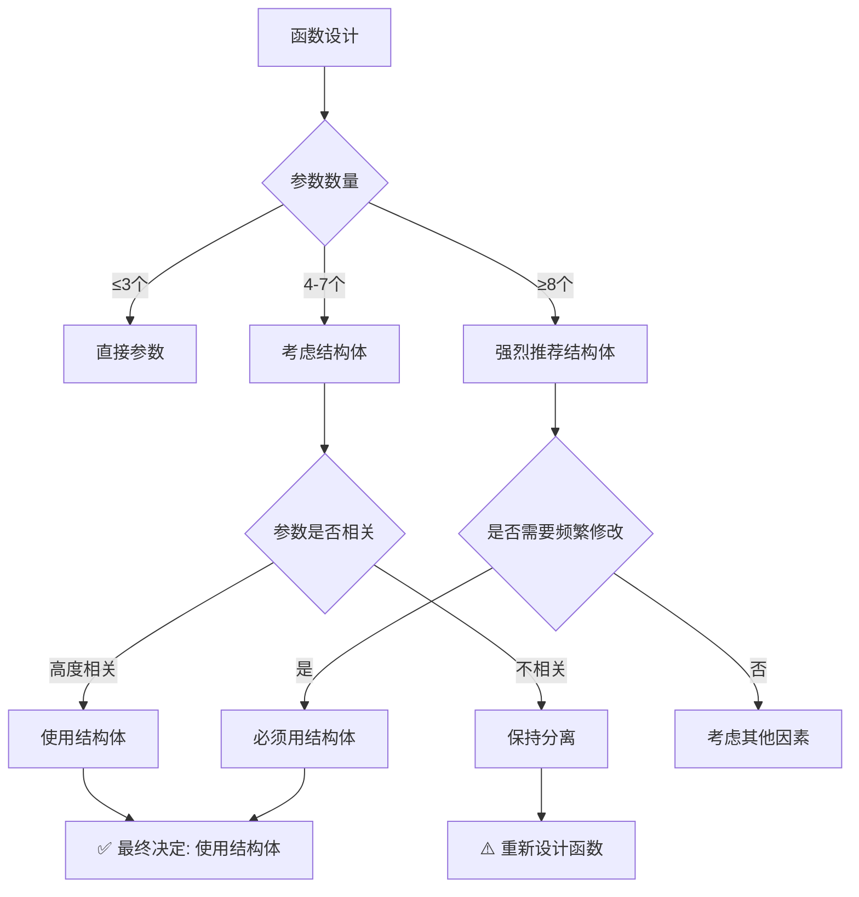

# 函数输入参数是否应该使用结构体：深入分析

在理想情况下，**函数输入参数应该尽可能使用结构体**，但这需要根据具体情况权衡。以下是详细分析：

## 一、理论基础：为什么应该使用结构体

### 1. **参数分组原则**
```julia
# 违反单一职责原则
function process_data(data, format, compress, validate, log, cache_size, timeout)
    # 太多不相关的参数
end

# 符合单一职责原则
struct ProcessingConfig
    format::Symbol
    compress::Bool
    validate::Bool
    log::Bool
end

function process_data(data, config::ProcessingConfig)
    # 配置相关的参数被合理分组
end
```

### 2. **信息隐藏原则**
```julia
# 暴露过多实现细节
function solve(algorithm, tolerance, max_iter, preconditioner, restart, krylov_dim)
    # 调用者需要了解所有实现细节
end

# 隐藏实现细节
struct SolverConfig
    # 内部可决定哪些参数需要暴露
end

function solve(problem, config::SolverConfig)
    # 调用者只需关注"解决什么问题"，而非"如何解决"
end
```

## 二、参数数量与结构体使用决策树



## 三、适用结构体的场景矩阵

| 场景 | 推荐程度 | 原因 | 示例 |
|------|----------|------|------|
| **配置参数** | ⭐⭐⭐⭐⭐ | 参数多且常修改 | 算法配置、数据库连接 |
| **物理参数组** | ⭐⭐⭐⭐⭐ | 参数逻辑相关 | 材料属性、边界条件 |
| **选项标志** | ⭐⭐⭐⭐ | 组合爆炸风险 | 格式化选项、特性开关 |
| **性能参数** | ⭐⭐⭐⭐ | 需要类型安全 | 缓存大小、线程数 |
| **I/O参数** | ⭐⭐⭐ | 路径/格式相关 | 文件路径、编码格式 |

## 四、理想情况的具体实现

### 1. **核心原则：参数分类分层**
```julia
# 顶级函数接口
function simulate(problem::Problem, params::SimulationParams)::Result
    # 所有配置通过params传递
end

# 分层配置结构
struct SimulationParams
    physics::PhysicsParams      # 物理参数
    numerics::NumericalParams   # 数值参数
    io::IOParams                # I/O参数
    control::ControlParams      # 控制参数
end

# 每层有自己的验证逻辑
function validate(params::SimulationParams)
    validate(params.physics)
    validate(params.numerics)
    # ...
end
```

### 2. **构建器模式确保正确性**
```julia
# 确保构造时即验证
function SimulationParams(;
    physics=PhysicsParams(),
    numerics=NumericalParams(),
    io=IOParams(),
    control=ControlParams()
)
    params = SimulationParams(physics, numerics, io, control)
    validate(params)  # 构造时验证
    return params
end

# 或者使用@kwdef宏
using Base: @kwdef

@kwdef struct SimulationParams
    physics::PhysicsParams = PhysicsParams()
    numerics::NumericalParams = NumericalParams()
    io::IOParams = IOParams()
    control::ControlParams = ControlParams()
    
    function SimulationParams(physics, numerics, io, control)
        params = new(physics, numerics, io, control)
        validate(params)
        return params
    end
end
```

## 五、需要谨慎使用的场景

### 1. **性能关键路径**
```julia
# 对于频繁调用的小函数，结构体可能带来开销
function dot(x::Vector{Float64}, y::Vector{Float64})::Float64
    # 直接参数更高效
    sum(x[i] * y[i] for i in 1:length(x))
end

# 但如果参数需要传递多个层级...
function compute_layer(input, weights, bias, activation, dropout, batch_norm)
    # 即使参数多，如果只在顶层使用一次，可能不需要结构体
end
```

### 2. **简单工具函数**
```julia
# 工具函数通常简单直接
format_date(year::Int, month::Int, day::Int) = "$year-$month-$day"

# 使用结构体反而过度设计
struct DateParams
    year::Int
    month::Int
    day::Int
end
format_date(params::DateParams) = "$(params.year)-$(params.month)-$(params.day)"
```

### 3. **接口兼容性要求**
```julia
# 需要与现有API保持兼容
function legacy_api(x, y, z, a, b, c)
    # 不能修改签名
end

# 可以添加新接口
function new_api(params::NewParams)
    # 内部调用旧API
    legacy_api(params.x, params.y, params.z,
               params.a, params.b, params.c)
end
```

## 六、量化决策框架

### 决策公式（启发式）：
```
是否需要结构体 = 
    (参数数量 ≥ 阈值) OR
    (参数相关度 > 相关性阈值) OR
    (变更频率 > 变更阈值) OR
    (传递层级 > 层级阈值)

其中：
- 参数数量阈值：通常4-5
- 参数相关度：共享生命周期/总参数数
- 变更频率：预计每月修改次数
- 传递层级：函数调用深度
```

### 示例计算：
```julia
function analyze_function(func)
    n_params = count_parameters(func)
    cohesion = calculate_cohesion(func)  # 参数相关度
    volatility = estimate_volatility(func)  # 变更频率
    
    need_struct = 
        n_params >= 5 ||
        cohesion > 0.7 ||
        volatility > 2  # 每月修改2次以上
    
    return need_struct
end
```

## 七、Julia特定最佳实践

### 1. **利用多重分派**
```julia
# 结构体使多重分派更强大
struct SolverConfigA
    tolerance::Float64
    max_iter::Int
end

struct SolverConfigB
    tolerance::Float64
    restart::Int
end

# 不同配置选择不同算法
function solve(problem, config::SolverConfigA)
    # 使用算法A
end

function solve(problem, config::SolverConfigB)
    # 使用算法B
end
```

### 2. **性能优化考虑**
```julia
# 使用不可变结构体提高性能
struct ImmutableConfig
    a::Int
    b::Float64
    c::String
end

# 编译器可以更好优化
function process(config::ImmutableConfig)
    # 编译器知道config不会改变
end
```

### 3. **默认参数与关键字参数**
```julia
# Julia的关键字参数已经很强大
function f(x; a=1, b=2, c=3, d=4)
    # 对于4个可选参数，关键字参数可能足够
end

# 但当参数更多或需要分组时...
function f(x; config::MyConfig=default_config())
    # 结构体更清晰
end
```

## 八、实际项目经验法则

### **"结构体优先"的指导原则**：

1. **3-5-8规则**：
   - 3个以下参数：直接传递
   - 3-5个参数：考虑是否需要结构体
   - 5-8个参数：很可能需要结构体
   - 8个以上参数：必须使用结构体

2. **变更频率规则**：
   - 预计参数会频繁变更 → 使用结构体
   - 参数稳定不变 → 可考虑直接传递

3. **传递深度规则**：
   - 参数需要传递超过2层函数调用 → 使用结构体
   - 只在当前函数使用 → 可考虑直接传递

4. **测试复杂度规则**：
   - 测试时需要多种参数组合 → 使用结构体
   - 只有少数固定场景 → 可考虑直接传递

## 九、结论

**在理想情况下，函数输入参数应该使用结构体当且仅当**：

1. ✅ **参数数量多**（通常≥5个）
2. ✅ **参数逻辑相关**（共享概念）
3. ✅ **参数频繁变化**（维护成本高）
4. ✅ **参数跨层传递**（需要上下文传递）
5. ✅ **需要类型安全验证**

**但应避免结构体当**：
1. ❌ **参数极少且简单**
2. ❌ **性能关键路径且调用频繁**
3. ❌ **需要与现有简单API兼容**
4. ❌ **过度设计带来不必要复杂性**

### 最终建议：
对于Julia科学计算和工程应用，特别是你的运输积分函数，**强烈推荐使用结构体**。原因：
1. 参数数量多（明显超过5个）
2. 参数逻辑分组清晰（物理参数、数值参数、积分参数）
3. 需要类型安全和验证
4. 可能在不同函数间共享配置

但记得：
- 保持结构体扁平，避免过度嵌套
- 提供方便的构造函数和默认值
- 实现验证逻辑
- 考虑性能影响（使用不可变结构体）

**理想设计**：
```julia
struct ShearViscosityParams
    quark::QuarkParams
    thermo::ThermoParams
    tau::TauParams
    degeneracy::Float64
end

struct IntegrationConfig
    p_nodes::Int
    p_max::Float64
    p_grid::Union{Nothing, Vector{Float64}}
    # ...
end

function shear_viscosity(
    params::ShearViscosityParams,
    config::IntegrationConfig=default_integration_config()
)::Float64
    # 清晰、类型安全、易于维护
end
```